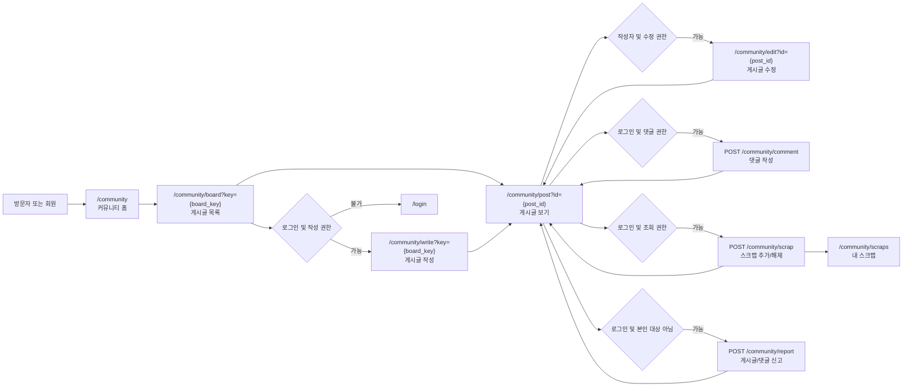
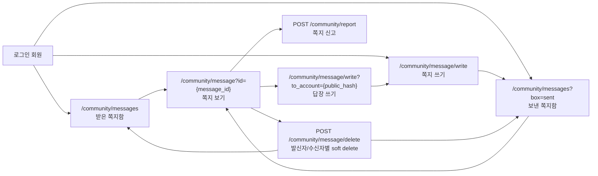
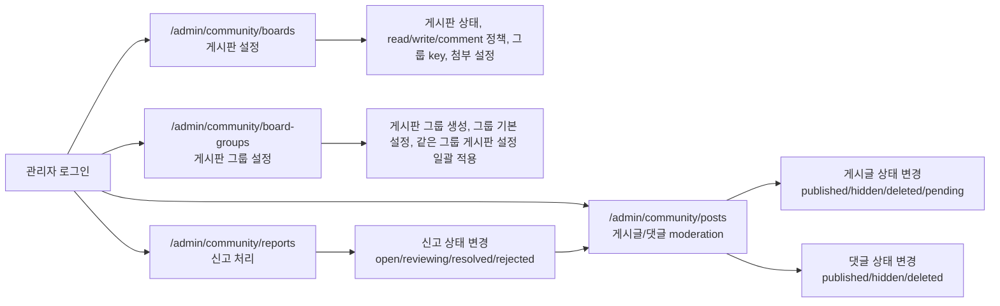

# 커뮤니티 모듈 제작 계획

이 문서는 Toycore 커뮤니티 모듈의 구현 상세 계획과 현재 구현 상태를 정리한다. 커뮤니티 관련 판단은 가급적 이 문서 하나에서 추적한다.

문서 운영 원칙:

- 커뮤니티 구현 계획, 진행상황, 남은 작업은 이 문서 하나에 유지한다.
- 커뮤니티 구현 관련 별도 계획 문서를 추가하지 않는다.
- 다른 문서에서 커뮤니티 구현 세부를 길게 다뤄야 할 때는 새 문서를 만들기보다 이 문서의 해당 절을 갱신한다.

## 1. 현재 구현 진행상황

기준일: 2026-05-12

| 영역 | 상태 | 메모 |
| --- | --- | --- |
| 모듈 골격과 설치 | 구현됨 | `modules/community` 구조, 설치 SQL, route, admin/menu 계약이 있음 |
| 공개 홈/목록/보기 | 구현됨 | 공개 게시판 목록/글 보기, theme/skin allowlist, 공개 글 sitemap 연동이 있음 |
| 게시글/댓글 작성 | 구현됨 | 작성/수정/삭제, 댓글 작성/삭제, CSRF, rate limit, 감사 로그가 있음 |
| 신고 | 구현됨 | 게시글/댓글/쪽지 신고, 중복 신고 차단, 관리자 처리 상태 변경이 있음 |
| 쪽지 | 구현됨 | 받은/보낸 쪽지함, 작성, 읽음 처리, 발신자/수신자별 soft delete, 신고가 있음 |
| 스크랩 | 구현됨 | 개인 스크랩 추가/해제와 목록, 조회 권한이 사라진 글의 링크 숨김 처리가 있음 |
| 관리자 화면 | 구현됨 | 게시판 설정, 게시글/댓글 moderation, 신고 처리 화면과 role guard가 있음 |
| 첨부 | 구현됨 | 이미지 업로드와 일반 파일 업로드 검증, 저장, 첨부 응답, 게시글 상태별 접근 제한이 있음 |
| 계약 파일 | 구현됨 | `menu-links.php`, `extension-points.php`, `sitemap.php`, `privacy-export.php`, `member-group-rules.php` 제공 |
| 회원 그룹 연동 | 구현됨 | 게시판 read/write/comment group key 검증과 커뮤니티 활동 기반 그룹 재평가가 있음 |
| 선택적 알림 연동 | 구현됨 | 새 쪽지, 새 댓글, 새 신고 알림을 notification 모듈이 활성화된 경우에만 생성 |
| 쪽지 본문 최소 조회 | 구현됨 | 쪽지 목록, 신고 대상 확인, 삭제 처리에서 본문을 조회하지 않는 helper를 사용 |
| 회원 id 비노출 | 구현됨 | 쪽지 발송/답장 URL은 공개용 회원 해시를 쓰고, 공개/신고/관리자 회원 라벨은 숫자 id를 붙이지 않음 |
| 공개 회원 해시 역조회 | 구현됨 | DB 스키마 확장 없이 요청 단위 해시 map 캐시로 반복 역조회 비용을 줄임 |
| 커뮤니티 전용 레벨제 | 구현됨 | member 그룹과 별도로 community가 레벨 정의, 회원별 레벨 snapshot, 게시판/쪽지 복합 접근 정책을 소유한다 |
| 커뮤니티 설정 화면 | 구현됨 | `/admin/community/settings`에서 레벨 사용 여부, 그룹/레벨 우선순위, 쪽지 발송 조건, theme 같은 모듈 단위 설정을 관리한다 |
| 릴리스 준비 | 구현됨 | `php .tools/bin/check.php`는 커뮤니티 v1 릴리스 기준, enabled 모듈 route 로딩, 패키지 최상위 구조, 계약 파일 구조, 설치 SQL 핵심 구조, sitemap/privacy export 범위, 스타일 경계, 회원 전용 action guard, 계약 파일 선언/존재, 모듈 버전/update SQL 정책을 확인한다. HTTP smoke는 커뮤니티 public/admin 진입점, 비로그인 작성/수정/삭제/댓글/신고/쪽지/스크랩 guard, sitemap endpoint, 내부 파일 보호를 점검한다. 인증 smoke는 작성/수정/댓글/스크랩/쪽지/신고/관리자 처리 성공 흐름과 쪽지 수신자 해시 링크 노출을 점검하며 로컬 테스트 환경에서 통과함 |

현재 남은 우선순위:

1. 배포 직전 실제 스테이징 환경에서 `.tools/bin/smoke-http.php`와 `.tools/bin/smoke-community-auth.php`를 다시 실행해 서버 설정, DB 권한, 보호 경로 응답을 최종 확인한다.

## 1-1. 기능명세서

이 절은 구현 계획과 별도로 커뮤니티 모듈 v1이 사용자에게 제공해야 하는 기능을 제품 관점에서 정리한다. 구현 상세는 뒤 절의 정책, 데이터 구조, action, helper 계획을 따른다.

### 1-1-1. 사용자 역할

방문자:

- 공개 커뮤니티 홈, 공개 게시판 목록, 공개 게시글을 조회할 수 있다.
- 작성, 댓글, 신고, 쪽지, 스크랩 요청 시 로그인 화면으로 이동한다.
- 공개 sitemap에 포함된 커뮤니티 URL을 검색 엔진 경유로 접근할 수 있다.

로그인 회원:

- 권한이 허용된 게시판에서 게시글을 작성, 수정, 삭제 요청할 수 있다.
- 권한이 허용된 게시글에 댓글을 작성하고 본인 댓글을 삭제 요청할 수 있다.
- 본인이 조회할 수 있는 게시글, 댓글, 쪽지를 신고할 수 있다.
- 다른 active 회원에게 1:1 plain text 쪽지를 발송하고 받은/보낸 쪽지함을 사용할 수 있다.
- 조회 가능한 공개 게시글을 개인 스크랩으로 저장하거나 해제할 수 있다.
- 본인의 커뮤니티 개인정보 export 범위에 게시글, 댓글, 신고, 쪽지, 스크랩 데이터가 포함된다.

관리자:

- `owner`, `admin`, `manager` 역할은 커뮤니티 관리자 화면에 접근할 수 있다.
- `owner`, `admin`은 게시판 기본 정보, 상태, 권한, 첨부, 표시 정책을 변경할 수 있다.
- `owner`, `admin`, `manager`는 게시글/댓글 moderation과 신고 상태 처리를 수행할 수 있다.
- 신고된 쪽지는 metadata와 신고 사유 중심으로 처리하며, v1 관리자 화면에서는 일반 쪽지 본문 열람 기능을 제공하지 않는다.

선택 모듈:

- `member` 모듈은 계정, 로그인, 공개 회원 요약, 공개 회원 해시, 회원 그룹 membership 확인을 제공한다.
- `notification` 모듈은 활성화된 경우에만 새 댓글, 새 쪽지, 새 신고 알림을 생성한다.
- 배너, 팝업레이어 같은 선택 모듈은 `extension-points.php`가 선언한 output slot에 붙을 수 있다.

### 1-1-2. 공개 화면 기능

커뮤니티 홈:

- URL: `/community`
- 활성 게시판 목록을 보여준다.
- 게시판이 없거나 모두 비활성 상태이면 빈 상태를 보여준다.
- 커뮤니티 홈은 module theme view를 사용한다.

게시판 목록:

- URL: `/community/board?key={board_key}`
- 게시판 상태가 `enabled`이고 현재 사용자가 `read_policy`를 만족할 때 목록을 보여준다.
- 게시글은 `published` 상태 중심으로 노출하고, 관리자 moderation 대상 상태는 일반 목록에서 숨긴다.
- 페이지당 글 수, 기본 정렬, 조회수 표시, 댓글 수 표시, 작성자 표시 방식은 게시판 설정을 따른다.
- 게시판 화면은 board skin view를 사용한다.

게시글 보기:

- URL: `/community/post?id={post_id}`
- 게시판과 게시글이 공개 조회 가능한 상태일 때 제목, 본문, 작성자 표시명, 작성일, 조회수, 첨부 이미지, 댓글 목록을 보여준다.
- 본문은 plain text로 저장하고 escape 후 줄바꿈만 반영한다.
- HTML, Markdown, WYSIWYG 본문 렌더링은 v1에서 제공하지 않는다.
- 게시글 보기 화면에는 권한에 따라 수정, 삭제 요청, 댓글 작성, 신고, 스크랩 버튼을 노출한다.
- 공개 게시글은 sitemap과 SEO tag 생성 대상이 된다.

### 1-1-3. 게시글과 댓글 기능

게시글 작성:

- URL: `/community/write?key={board_key}`
- 로그인 회원만 접근할 수 있다.
- 게시판 `write_policy`가 `member`, `group`, `admin` 중 현재 사용자 조건을 만족해야 한다.
- 제목, 본문, 선택 첨부 이미지를 입력한다.
- 게시판의 제목 최대 길이, 본문 최대 길이, 기본 작성 상태, 첨부 설정을 검증한다.
- 성공 후 게시글 보기 화면으로 이동한다.

게시글 수정:

- URL: `/community/edit?id={post_id}`
- 작성자이고 게시판의 수정 허용 정책을 만족하거나, 관리자 moderation 권한이 있어야 한다.
- 기존 첨부 상태와 새 첨부 업로드를 게시판 첨부 정책 안에서 처리한다.
- 수정 후 감사 로그와 `updated_at`을 남긴다.

게시글 삭제 요청:

- 작성자는 본인 게시글을 삭제 상태로 전환할 수 있다.
- v1은 물리 삭제보다 soft delete를 우선한다.
- 관리자는 별도 moderation 화면에서 숨김, 복구, 삭제 상태를 바꿀 수 있다.

댓글 작성:

- 로그인 회원만 작성할 수 있다.
- 게시판 `comment_policy`와 게시글 상태를 모두 만족해야 한다.
- 댓글 본문은 plain text로 저장하고 escape 출력한다.
- 작성자 자기 글 댓글에는 알림을 만들지 않는다.

댓글 삭제 요청:

- 작성자는 본인 댓글을 삭제 상태로 전환할 수 있다.
- 관리자는 댓글을 숨김, 복구, 삭제 상태로 전환할 수 있다.

### 1-1-4. 첨부 기능

- 첨부 대상은 게시글이며 댓글과 쪽지 첨부는 제외한다.
- 이미지 첨부는 JPEG, PNG, WebP를 허용한다.
- 일반 파일 첨부는 게시판 설정의 허용 확장자와 용량/개수 제한을 따른다.
- 파일명은 랜덤 파일명으로 저장하고 원본 파일명은 metadata로만 관리한다.
- 업로드 파일은 `toy_upload_validate_file()`과 게시판별 용량/개수 정책을 통과해야 한다.
- 이미지는 가능하면 재인코딩된 파일만 저장하고, 재인코딩 실패 시 업로드를 거부한다.
- 첨부 파일은 웹 직접 접근이 아니라 community attachment action을 통해 응답한다.
- 게시글이 hidden/deleted 상태가 되면 일반 사용자는 첨부를 볼 수 없다.

### 1-1-5. 신고 기능

- 대상은 게시글, 댓글, 쪽지이다.
- 로그인 회원만 신고할 수 있다.
- 본인이 작성했거나 본인이 대상인 콘텐츠는 신고할 수 없다.
- 같은 회원은 같은 대상에 중복 신고할 수 없다.
- 신고 사유는 allowlist key와 선택 memo로 저장한다.
- 신고 접수만으로 대상 콘텐츠를 자동 숨김 처리하지 않는다.
- 관리자는 신고 상태를 `open`, `reviewing`, `resolved`, `dismissed`로 변경한다.
- 신고 처리와 게시글/댓글 moderation 상태 변경은 분리한다.
- 쪽지 신고 처리에서는 본문을 조회하지 않고 발신자/수신자 metadata 중심으로 처리한다.

### 1-1-6. 쪽지 기능

- 로그인 회원 간 1:1 plain text 쪽지만 제공한다.
- 받은 쪽지함과 보낸 쪽지함을 제공한다.
- 쪽지 보기 시 발신자 또는 수신자만 접근할 수 있다.
- 받은 쪽지를 열면 읽음 시간이 기록된다.
- 발신자 삭제와 수신자 삭제는 서로 독립적인 soft delete로 처리한다.
- 답장 URL, 수신자 preset, hidden form 값처럼 브라우저에 노출되는 회원 식별자는 숫자 `account_id`가 아니라 공개용 회원 해시를 사용한다.
- 공개용 회원 해시는 인증 수단이 아니며, 서버 내부 저장과 권한 검사는 실제 `account_id`를 사용한다.
- 일반 쪽지 관리자 본문 열람, 단체 쪽지, 첨부, thread UI, 차단 목록은 v1에서 제외한다.

### 1-1-7. 스크랩 기능

- 로그인 회원의 개인 게시글 저장함으로 제공한다.
- 게시글 보기에서 스크랩 추가/해제를 POST로 수행한다.
- 같은 회원과 게시글 조합은 하나만 저장한다.
- 현재 계정이 조회할 수 있는 `published` 게시글만 스크랩할 수 있다.
- 내 스크랩 목록에서는 게시글 조회 권한을 다시 확인한다.
- hidden/deleted 글이나 권한이 사라진 글은 링크를 숨기고 비공개 또는 삭제 상태로 표시한다.
- 스크랩 수는 공개 랭킹, 추천, SEO, 게시글 정렬 점수에 사용하지 않는다.

### 1-1-8. 관리자 기능

게시판 설정:

- 게시판 key, 제목, 설명, 상태, 정렬 순서를 관리한다.
- 읽기, 작성, 댓글 정책과 허용 회원 그룹 key를 관리한다.
- 게시판 그룹은 게시판 표시 분류와 그룹 기본 설정을 관리한다.
- 게시판은 설정별로 개별 설정을 쓰거나 그룹 기본값을 따르도록 선택할 수 있다.
- 그룹 관리자는 선택한 설정을 같은 그룹의 게시판들에 일괄 적용할 수 있다. 이 일괄 적용은 현재 그룹 값을 각 게시판 설정에 복사하는 동작이며, 이후 그룹 변경을 자동 추적하지 않는다.
- 게시판 그룹은 회원 그룹 권한과 다르다. 회원 그룹은 사람의 접근 조건이고, 게시판 그룹은 게시판 묶음과 운영 기본값이다.
- 게시글/댓글 기본 상태, 길이 제한, 작성자 수정/삭제 요청 허용 여부를 관리한다.
- 이미지 첨부와 일반 파일 첨부의 허용 여부, 최대 개수, 최대 용량, 허용 형식을 관리한다.
- 목록 표시, SEO, moderation, theme/skin 설정을 관리한다.

커뮤니티 설정:

- `/admin/community/settings`에서 모듈 단위 설정을 관리한다.
- 커뮤니티 전용 레벨제 사용 여부와 레벨 산정 기본값을 관리한다.
- 게시판과 쪽지 기능에서 회원 그룹과 커뮤니티 레벨 조건을 함께 설정했을 때 어떤 조건을 우선할지 관리한다.
- 쪽지 발송 가능 조건처럼 특정 게시판에 속하지 않는 커뮤니티 기능의 기본 접근 정책을 관리한다.

게시글/댓글 moderation:

- 게시글 상태를 `published`, `pending`, `hidden`, `deleted`로 관리한다.
- 댓글 상태를 `published`, `hidden`, `deleted`로 관리한다.
- 관리자 moderation action은 CSRF와 역할 권한을 확인한다.

신고 처리:

- 신고 목록에서 대상 유형, 신고자, 대상 회원, 사유, 상태, 접수 시간을 확인한다.
- 상태 변경과 review note를 저장한다.
- 신고 대상이 게시글/댓글이면 별도 moderation 화면으로 이동해 숨김 또는 삭제를 처리한다.

### 1-1-9. 연동과 계약 기능

회원 그룹:

- 게시판 `read_policy`, `write_policy`, `comment_policy`가 `group`이면 member 모듈의 공개 helper로 membership만 확인한다.
- community는 member 그룹 membership 테이블을 직접 조회하거나 변경하지 않는다.
- 커뮤니티 활동 기반 그룹 자동화 조건 후보는 `member-group-rules.php`로 제공한다.
- 게시글 작성 성공 또는 게시글 상태 변경으로 published 집계가 바뀔 수 있으면 member 그룹 재평가 helper를 명시 호출한다.

커뮤니티 레벨:

- 레벨 정의와 회원별 현재 레벨은 community 모듈이 소유한다.
- member 계정 테이블이나 member 그룹 테이블을 넓히지 않고 `account_id`로 연결한다.
- 게시판과 쪽지 접근 판단에서는 member 그룹 membership과 community 레벨 snapshot을 함께 읽는다.
- 접근 요청에서는 레벨을 새로 계산하지 않고 저장된 snapshot만 조회한다.
- 활동 후 레벨 자동 재계산은 기본값이 꺼져 있으며, 운영자가 설정 화면에서 켠 경우에만 실행한다.

알림:

- notification 모듈이 활성화되어 있고 helper가 로드 가능한 경우에만 알림을 만든다.
- 새 댓글은 게시글 작성자에게 알린다.
- 새 쪽지는 수신자에게 알린다.
- 새 신고는 활성 관리자 역할 계정에게 알린다.
- 알림 생성 실패는 댓글 작성, 쪽지 발송, 신고 접수를 롤백하지 않는다.

공통 계약:

- `paths.php`는 public/account/admin action 경로를 명시한다.
- `admin-menu.php`는 커뮤니티 관리자 메뉴를 제공한다.
- `menu-links.php`는 공개 커뮤니티 메뉴 링크를 제공한다.
- `extension-points.php`는 community 화면의 output slot 위치를 선언한다.
- `sitemap.php`는 공개 게시판과 공개 게시글 URL을 제공한다.
- `privacy-export.php`는 회원별 커뮤니티 개인정보 export를 제공한다.

### 1-1-10. 보안과 개인정보 요구사항

- 모든 POST action은 CSRF를 확인한다.
- 글 작성, 댓글, 신고, 쪽지 등 abuse 가능성이 있는 action은 rate limit을 적용한다.
- 사용자 입력 출력은 `toy_e()` 등 escape helper를 거친다.
- HTML 본문, script, inline style 저장/출력은 v1에서 허용하지 않는다.
- 쪽지 발송, 답장, 신고, 관리자 표시에서 숫자 회원 ID를 사용자에게 직접 노출하지 않는다.
- 토큰 원문, secret, password, checksum hash 같은 민감 값은 개인정보 export에 포함하지 않는다.
- 관리자는 v1에서 일반 쪽지 본문을 열람하지 않는다.
- attachment 응답은 `Content-Type`과 `X-Content-Type-Options`를 명시한다.
- community는 core/member 테이블을 넓히지 않고 자기 도메인 테이블에 데이터를 둔다.

### 1-1-11. 완료 수용 기준

- 신규 설치에서 community 선택 설치가 가능하다.
- 기존 설치에서 `/admin/modules`로 community를 설치하고 `/admin/updates`에서 스키마 상태를 확인할 수 있다.
- 비로그인 사용자는 공개 조회만 가능하고 회원 action은 로그인 화면으로 이동한다.
- 로그인 회원은 게시글 작성, 수정, 댓글 작성, 신고, 쪽지, 스크랩의 정상 흐름을 수행할 수 있다.
- 관리자는 게시판 설정, 게시글/댓글 moderation, 신고 상태 처리를 수행할 수 있다.
- 쪽지 URL과 화면에는 숫자 회원 ID가 노출되지 않는다.
- 스크랩 목록은 현재 조회 권한을 다시 확인한다.
- notification 모듈이 없어도 community 핵심 기능은 동작한다.
- `php .tools/bin/check.php`, `.tools/bin/smoke-http.php`, `.tools/bin/smoke-community-auth.php` 기준 검수가 가능하다.

## 2. 커뮤니티 모듈 v1 범위

모듈 key는 `community`로 가정한다. 테이블명은 프로젝트 prefix를 사용해 `toy_community_*`로 둔다.

v1은 "게시판별 운영 정책을 깊게 설정할 수 있는 게시판형 커뮤니티" 하나를 작게 제공한다. 단순 CRUD보다 게시판별 접근, 작성, 댓글, 첨부, SEO, moderation 정책을 관리자가 분리해 조정할 수 있는 점을 설득 포인트로 둔다.

포함:

- 공개 게시글 목록
- 공개 게시글 보기
- 로그인 회원 게시글 작성/수정/삭제 요청
- 로그인 회원 댓글 작성/삭제 요청
- 로그인 회원 게시글/댓글 신고
- 로그인 회원 간 쪽지 발송/수신/삭제
- 로그인 회원 게시글 스크랩
- 관리자 게시판 상세 설정
- 관리자 게시글/댓글 숨김, 복구, 삭제 상태 관리
- 관리자 신고 접수 확인과 처리 상태 관리
- 이미지 첨부와 일반 파일 첨부
- 모듈 테마와 게시판별 스킨 선택 구조
- sitemap, menu link, privacy export, extension point 계약
- 회원 그룹 기반 접근 정책 연동 계획
- 선택적 notification 연동

제외:

- WYSIWYG 편집기
- Markdown
- HTML 본문 허용
- nested comment
- reaction, like, point 연동
- 자동 블라인드 workflow
- 쪽지 첨부
- 쪽지 단체 발송
- 댓글 스크랩
- 공개 스크랩 수 랭킹
- 별도 search 모듈
- captcha plugin
- 멀티사이트
- 커뮤니티 화면용 CSS 작성
- 완성형 skin/theme pack
- 커뮤니티 데이터를 core 또는 member 계정 테이블에 추가하는 방식

## 3. v1 정책 결정

### 3-1. 렌더링

v1 본문 형식은 plain text로 고정한다.

- DB에는 `body_format = 'plain'`을 저장한다.
- 출력은 `toy_e()` 후 줄바꿈만 `nl2br()`로 반영한다.
- HTML 입력은 저장하지 않고 텍스트로 취급한다.
- Markdown과 WYSIWYG는 v2 이후 별도 결정한다.

이유:

- sanitizer를 core에 넣지 않는 프로젝트 방향과 맞다.
- 첫 모듈의 XSS 표면을 줄인다.
- 공유호스팅에서 외부 parser 의존성을 피한다.

### 3-2. 댓글

v1 댓글은 `community` 모듈 내부에 둔다.

이유:

- 게시글과 댓글의 공개 상태, 삭제 상태, 알림 정책이 강하게 묶인다.
- 첫 구현에서 별도 comment 모듈 계약을 만들면 코어와 모듈 경계가 불필요하게 커진다.
- 다른 콘텐츠 모듈이 생기고 댓글 요구가 반복될 때 분리한다.

### 3-3. 첨부

v1 최초 구현은 이미지 파일만 지원했다. 2026.05.003부터 게시글 일반 파일 첨부도 지원한다.

- 대상: 게시글 첨부만 지원
- 댓글 첨부는 제외
- 이미지 허용 형식: JPEG, PNG, WebP
- 일반 파일 허용 형식: 게시판 설정의 allowlist 확장자와 MIME 조합
- 저장 위치: `storage/community/attachments/...`
- 웹 직접 접근을 전제로 하지 않는다.
- 공개 응답 action이 파일을 읽어 `Content-Type`과 `X-Content-Type-Options`를 설정한 뒤 출력한다.

업로드 정책:

- `toy_upload_validate_file()` 사용
- `max_bytes`, `allowed_extensions`, `allowed_mime_types`를 명시
- 저장 파일명은 `toy_upload_random_filename()` 사용
- 가능하면 `toy_upload_reencode_image()`로 재인코딩
- 재인코딩에 실패하면 업로드를 거부한다.
- 첨부 기능은 환경 문제로 실패해도 게시글 텍스트 기능을 막지 않는다.

### 3-4. 공개 범위

v1 기본값은 비로그인 읽기 허용, 로그인 작성이다.

- 공개 게시판과 게시글은 비로그인 조회 가능
- 작성, 수정, 삭제 요청, 댓글 작성은 로그인 필수
- 관리자 화면은 `owner`, `admin`, `manager` 중 정책별로 제한
- SEO 목적의 sitemap은 공개 게시글만 포함

게시판별 핵심 상태는 `toy_community_boards`에 두고, 깊이가 있는 운영 설정은 `toy_community_board_settings`에 둔다. 자주 조회하고 인덱스 판단에 필요한 값은 컬럼으로 유지하되, 길이 제한, 첨부, SEO, 표시 정책처럼 확장 가능성이 큰 값은 설정 테이블로 분리한다.

```text
read_policy: public | member | group
write_policy: member | group | admin
comment_policy: member | group | disabled
```

`group` 정책은 member 모듈의 회원 그룹 기능이 구현된 뒤 활성화한다. community는 그룹 membership을 직접 저장하지 않고 member 공개 helper로 확인한다.

후속 레벨제에서는 기존 정책 값을 늘리기보다 게시판 설정에 `read_min_level`, `write_min_level`, `comment_min_level`을 추가한다.

- `read_policy = public`은 공개 접근이므로 레벨과 그룹 조건을 적용하지 않는다.
- `read_policy = member`에 `read_min_level`이 있으면 로그인 회원 중 해당 커뮤니티 레벨 이상만 읽을 수 있다.
- `*_policy = group`에 그룹 key와 최소 레벨이 함께 있으면 `/admin/community/settings`의 그룹/레벨 우선순위 설정으로 판정한다.
- `write_policy = admin`과 `comment_policy = disabled`는 그룹/레벨 조건보다 먼저 적용한다.

### 3-5. 게시판 상세 설정

관리자 게시판 설정은 v1의 핵심 화면이다. 설정은 다음 묶음으로 나눈다.

기본 정보:

- 게시판 key
- 제목
- 설명
- 상태: enabled | disabled | archived
- 정렬 순서

접근 정책:

- 읽기 정책: public | member | group
- 작성 정책: member | group | admin
- 댓글 정책: member | group | disabled
- 허용 회원 그룹 key 목록
- 최소 커뮤니티 레벨

글 정책:

- 기본 작성 상태: published | pending
- 제목 최대 길이
- 본문 최대 길이
- 작성자 수정 허용 여부
- 작성자 삭제 요청 허용 여부
- 수정 허용 시간 제한

댓글 정책:

- 댓글 기본 상태: published | pending
- 댓글 최대 길이
- 작성자 삭제 요청 허용 여부
- 글이 hidden/deleted일 때 댓글 작성 차단

첨부 정책:

- 이미지 첨부 허용 여부
- 일반 파일 첨부 허용 여부
- 게시글당 최대 이미지 수
- 이미지 최대 용량
- 허용 이미지 형식

목록/표시 정책:

- 페이지당 글 수
- 기본 정렬
- 조회수 표시 여부
- 댓글 수 표시 여부
- 작성자 표시 방식

SEO 정책:

- 게시판 목록 index 허용 여부
- 게시글 index 허용 여부
- 게시판 meta description

운영 정책:

- manager moderation 허용 여부
- soft delete 기본 사용
- pending 글 관리자 승인 필요 여부
- 신고 접수 사용 여부
- 신고 누적 시 관리자 화면 강조 기준

화면 정책:

- 게시판 스킨 key
- 모듈 테마 key

### 3-5-1. 신고

v1 신고 기능은 community 모듈 내부 moderation 보조 기능으로 둔다.

대상:

- 게시글 신고
- 댓글 신고
- 쪽지 신고

기본 정책:

- 로그인 회원만 신고할 수 있다.
- 같은 회원이 같은 대상을 반복 신고하지 못하게 한다.
- 신고 사유는 allowlist key와 선택 입력 메모로 저장한다.
- 신고 접수만으로 게시글, 댓글, 쪽지를 자동 숨김 처리하지 않는다.
- 관리자는 신고 상태를 `open`, `reviewing`, `resolved`, `dismissed`로 바꿀 수 있다.
- 관리자가 신고를 처리하면서 대상 게시글/댓글을 숨김 또는 삭제 상태로 바꾸는 것은 별도 moderation action으로 수행한다.

사유 key 후보:

```text
spam
abuse
personal_info
illegal
other
```

신고 기능이 하지 않는 것:

- 자동 블라인드
- 신고자와 피신고자 간 분쟁 조정 workflow
- 법적 보관 정책 자동화
- core 감사 로그를 대체하는 상세 moderation 시스템

### 3-5-2. 쪽지

v1 쪽지 기능은 로그인 회원 간 1:1 텍스트 메시지로 제한한다. member 모듈은 계정과 인증만 소유하고, 쪽지 도메인은 community 모듈이 소유한다.

포함:

- 받은 쪽지함
- 보낸 쪽지함
- 쪽지 작성
- 쪽지 읽음 처리
- 받은 사람/보낸 사람 기준 soft delete
- 쪽지 신고

제외:

- 단체 쪽지
- 첨부 파일
- 대화방/thread UI
- 실시간 알림
- 차단 목록
- 관리자 쪽지 본문 열람 화면

정책:

- 로그인 회원만 사용할 수 있다.
- 수신자는 active 회원이어야 한다.
- 쪽지 화면, 발송 폼, 답장 링크, 알림 본문에는 내부 `account_id`를 직접 노출하지 않는다.
- 수신자 프리셋이나 답장 대상처럼 화면/URL/form을 오가는 회원 식별자는 member 모듈이 제공하는 공개용 회원 해시를 사용한다.
- 공개용 회원 해시는 내부 PK를 추측할 수 없는 비밀 아닌 식별자로 취급하고, token/secret/hash 원본처럼 인증 수단으로 사용하지 않는다.
- 서버 내부 저장, 권한 검사, 감사 로그, 개인정보 export에서는 기존 `sender_account_id`와 `recipient_account_id`를 유지한다.
- 쪽지 본문은 plain text만 저장한다.
- 출력은 게시글 본문과 같이 `toy_e()`와 줄바꿈 처리만 사용한다.
- 삭제는 수신자/발신자별 삭제 표시로 처리하고, 양쪽 모두 삭제해도 물리 삭제는 v1에서 하지 않는다.
- 관리자는 신고된 쪽지 metadata와 신고 사유를 볼 수 있지만, 본문 열람 기능은 v1 관리자 화면에 넣지 않는다.
- 쪽지 신고 대상 확인과 삭제 처리는 본문을 조회하지 않고 발신자/수신자 식별 정보만 사용한다.
- 개인정보 export에는 본인이 보낸 쪽지와 받은 쪽지 metadata 및 본문을 포함한다.

### 3-5-3. 스크랩

v1 스크랩 기능은 로그인 회원의 개인 게시글 저장함으로 제한한다. 공개 인기 지표나 추천 정책으로 사용하지 않는다.

포함:

- 게시글 스크랩 추가
- 게시글 스크랩 해제
- 내 스크랩 목록

제외:

- 댓글 스크랩
- 게시판 스크랩
- 공개 스크랩 수 표시
- 스크랩 랭킹
- 스크랩 폴더/태그
- 다른 회원의 스크랩 목록 공개

정책:

- 로그인 회원만 스크랩할 수 있다.
- 현재 계정이 조회할 수 있는 published 게시글만 스크랩할 수 있다.
- 같은 회원이 같은 게시글을 중복 스크랩하지 못하게 한다.
- 게시글이 hidden/deleted 상태가 되거나 현재 계정의 게시판 조회 권한이 사라지면 내 스크랩 목록에서도 게시판/게시글 링크를 숨기고 비공개 또는 삭제 상태로 표시한다.
- 스크랩은 대상 게시글의 SEO, 정렬, 추천 점수에 영향을 주지 않는다.

### 3-6. 화면 구현과 스타일 경계

커뮤니티 모듈의 public/account/admin 화면은 최초 구현에서 최소한의 HTML과 필요한 vanilla JavaScript만 작성한다. CSS는 v1 구현 범위에 넣지 않는다.

규칙:

- 의미가 드러나는 기본 HTML 요소를 우선 사용한다.
- 화면 동작에 필요한 JS만 작성한다.
- JS가 필요하면 build step 없이 `assets/community.js` 같은 정적 파일로 둔다.
- `community.css` 또는 inline style을 작성하지 않는다.
- 이후 스타일 작업을 위한 `class`, `data-*`, wrapper id를 미리 남기지 않는다.
- `class`, `data-*`, wrapper id는 스크립트 동작에 필요한 경우에만 한정적으로 사용한다.
- 버튼, form, table, list 같은 구조는 브라우저 기본 스타일로도 사용 가능해야 한다.
- 화면 안내 문구는 기능 수행에 필요한 최소 문구만 둔다.

관리자 화면도 같은 원칙을 따른다. `admin` 모듈 공통 레이아웃이 제공하는 기본 구조 외에 community 전용 CSS를 추가하지 않는다.

추후 스타일 작업은 현재 DOM 구조를 보존해야 한다는 전제를 두지 않는다. 스타일 단계에서 필요한 경우 theme view와 skin view의 DOM 구조 자체를 변경할 수 있다.

### 3-6-1. 스크린 플로우차트

커뮤니티 v1 화면 흐름은 public 게시판 탐색, 로그인 회원 action, 관리자 moderation을 분리한다. 화면은 최소 HTML을 유지하고, 권한 판단은 action/helper에서 수행한다.







### 3-7. 모듈 테마와 게시판 스킨

커뮤니티 모듈은 모듈 테마와 게시판 스킨을 분리한다.

개념 구분:

```text
skin:
- 게시판에 한정해 적용되는 PHP view partial 묶음
- 특정 게시판의 글 목록, 게시글 보기, 글 작성/수정 form, 댓글/첨부 표시를 담당
- 해당 게시판 화면의 DOM 구조, 색감, 여백, 타이포그래피, 아이콘, asset 같은 디자인 표현을 담당
- form name, method, action, CSRF 위치, 출력 슬롯 호출 위치처럼 기능 DOM을 포함

theme:
- 게시판에 속하지 않는 community 모듈 화면을 담당하는 PHP view partial 묶음
- 커뮤니티 홈, 게시판 선택/안내, 모듈 단위 빈 상태 같은 비게시판 public 화면을 담당
- 후속 버전에서는 비게시판 화면의 DOM 구조와 디자인 표현도 담당할 수 있음
- 게시판 글 목록/보기/쓰기/댓글 화면에는 직접 적용하지 않음
```

판단 기준:

- 특정 게시판의 콘텐츠를 다루는 화면이면 `skin`이다.
- 게시판 key나 post id 없이 community 모듈 자체를 보여주는 화면이면 `theme`이다.
- 게시판 화면의 색감, 여백, 폰트 크기, 아이콘, 카드형/리스트형 같은 디자인을 바꾸면 `skin`이다.
- 커뮤니티 홈이나 게시판 선택 화면의 구조와 디자인을 바꾸면 `theme`이다.
- 접근 권한, validation, SEO, 개인정보, moderation 정책은 skin/theme이 아니라 community helper와 action이 판단한다.

운영자에게 보이는 설명:

```text
테마: 커뮤니티 홈과 모듈 단위 화면
스킨: 각 게시판의 목록, 글보기, 글쓰기 화면
```

운영 예:

```text
커뮤니티 테마: 기본 커뮤니티 홈
- 자유게시판 skin: 일반 목록형
- 사진게시판 skin: 갤러리형
- 문의게시판 skin: Q&A형
```

v1 구현 방향:

- 기본 theme은 `basic` 하나만 제공한다.
- 기본 skin은 `basic` 하나만 제공한다.
- 모듈 설정에는 `theme_key`를 저장한다.
- 게시판 설정에는 `skin_key`를 저장한다.
- `/community` 같은 비게시판 public action은 `theme_key`로 theme view를 include한다.
- 특정 board context가 있는 public action은 board 설정의 `skin_key`로 skin view를 include한다.
- v1 theme과 skin은 모두 본문 HTML만 제공하고 전역 `<html>/<head>/<body>` 레이아웃과 CSS/디자인 asset을 제공하지 않는다.
- 전역 public 레이아웃은 `layouts/public/basic/layout.php`가 담당한다.
- 알 수 없는 `theme_key`는 기본 `basic`으로 fallback한다.
- 알 수 없는 `skin_key`는 기본 `basic`으로 fallback한다.
- 관리자 화면은 v1에서 module theme은 `basic`, board skin은 `basic`만 선택 가능하게 하거나 읽기 전용으로 표시한다.

theme과 skin 파일은 자동 탐색하지 않는다. community helper에 명시된 allowlist만 사용한다.

예상 구조:

```text
modules/community/themes/basic/
- home.php

modules/community/skins/basic/
- list.php
- view.php
- form.php
```

적용 위치:

```text
theme 설정 저장:
- /admin/community/settings
- theme_key를 community 모듈 설정에 저장

board skin 설정 저장:
- /admin/community/boards
- skin_key를 toy_community_board_settings에 저장

theme 적용:
- /community
- board가 선택되지 않은 community 모듈 단위 public 화면
- action이 모듈 단위 데이터를 준비한 뒤 include할 theme view partial을 선택

skin 적용:
- /community/board
- /community/post
- /community/write
- /community/edit
- action이 board context와 데이터를 준비한 뒤 include할 skin view partial을 선택
```

theme 적용 방식:

```text
1. action이 community 모듈 설정을 조회한다.
2. toy_community_theme_key($settings)가 theme_key를 정규화한다.
3. toy_community_theme_view($themeKey, $viewKey)가 allowlist에서 view 파일을 찾는다.
4. action이 게시판 목록, 안내 문구, SEO 값을 준비한다.
5. action이 선택된 theme view 파일을 include한다.
```

theme view key 후보:

```text
home: 커뮤니티 홈 또는 게시판 선택 화면
```

v1의 `basic` theme mapping:

```text
home -> modules/community/themes/basic/home.php
```

theme view 책임:

- 게시판 선택이나 커뮤니티 홈 같은 모듈 단위 변수 출력
- `toy_e()` 같은 출력 escape
- 모듈 단위 output slot 호출 위치 제공
- 화면 SEO 배열을 만들고 `toy_public_layout_begin()`에 전달

theme view가 하지 않는 것:

- 전역 `<html>`, `<head>`, `<body>` 레이아웃 출력
- 특정 게시판의 글 목록/글보기/form 출력
- DB 변경
- 권한 최종 판단
- 게시판 정책 판단
- skin view include
- 다른 모듈 계약 파일 직접 읽기

skin 적용 방식:

```text
1. action이 board와 board settings를 조회한다.
2. toy_community_board_skin_key($pdo, $board)가 게시판 설정의 skin_key를 읽고 정규화한다.
3. toy_community_skin_view($skinKey, $viewKey)가 allowlist에서 view 파일을 찾는다.
4. action이 권한, 입력값, 조회 결과, SEO 값을 준비한다.
5. action이 선택된 skin view 파일을 include한다.
```

skin view key 후보:

```text
list: 게시판 글 목록
post: 게시글 보기
form: 글 작성/수정 form
```

v1의 `basic` skin mapping:

```text
list -> modules/community/skins/basic/list.php
post -> modules/community/skins/basic/view.php
form -> modules/community/skins/basic/form.php
```

skin view 책임:

- 특정 게시판의 글/댓글/첨부 관련 변수 출력
- `toy_e()`와 `nl2br(toy_e(...))` 같은 출력 escape
- CSRF field 출력
- 게시판 화면 output slot 호출 위치 제공
- form name/action/method 구조 유지
- 화면 SEO 배열을 만들고 `toy_public_layout_begin()`에 전달

skin view가 하지 않는 것:

- 전역 `<html>`, `<head>`, `<body>` 레이아웃 출력
- DB 변경
- 권한 최종 판단
- 게시판 정책 판단
- theme view include
- 다른 모듈 계약 파일 직접 읽기

후속 확장:

- 외부 theme 또는 skin plugin이 필요해지면 `community-themes.php` 또는 `community-skins.php` 같은 계약 파일을 검토한다.
- 이 계약을 추가할 때는 `TOY_MODULE_CONTRACT_VERSION`, `docs/module-guide.md`, 정적 검사를 함께 갱신한다.

## 4. 디렉터리 구조

```text
modules/community/
- module.php
- helpers.php
- helpers/
  - boards.php
  - posts.php
  - comments.php
  - attachments.php
  - reports.php
  - messages.php
  - scraps.php
  - settings.php
  - rate-limit.php
  - notifications.php
  - member-groups.php
  - skins.php
  - themes.php
- paths.php
- admin-menu.php
- menu-links.php
- extension-points.php
- member-group-rules.php
- privacy-export.php
- sitemap.php
- actions/
  - home.php
  - list.php
  - view.php
  - write.php
  - edit.php
  - delete.php
  - comment.php
  - comment-delete.php
  - report.php
  - messages.php
  - message-view.php
  - message-write.php
  - message-delete.php
  - scraps.php
  - scrap-toggle.php
  - attachment.php
  - admin-boards.php
  - admin-posts.php
  - admin-reports.php
- views/
  - admin-boards.php
  - admin-posts.php
  - admin-reports.php
  - partials.php
- themes/
  - basic/
    - home.php
- skins/
  - basic/
    - list.php
    - view.php
    - form.php
- assets/
  - community.js (필요할 때만)
- lang/
  - ko.php
- install.sql
- updates/
```

`helpers.php`는 하위 helper만 require한다. action 파일은 가능한 한 `modules/community/helpers.php` 하나만 require한다.

## 5. module.php 계획

```php
<?php

return [
    'name' => 'Community',
    'version' => '2026.05.001',
    'type' => 'module',
    'description' => 'Board-style community module.',
    'toycore' => [
        'min_version' => '0.1.1',
        'tested_with' => ['0.1.1'],
        'module_contract' => '1.0',
    ],
    'requires' => [
        'modules' => ['member', 'admin'],
    ],
    'contracts' => [
        'provides' => [
            'paths.php',
            'admin-menu.php',
            'menu-links.php',
            'extension-points.php',
            'member-group-rules.php',
            'privacy-export.php',
            'sitemap.php',
        ],
    ],
    'settings' => [
        'posts_per_page' => 20,
        'comments_per_page' => 50,
        'post_create_window_seconds' => 300,
        'post_create_limit' => 10,
        'comment_create_window_seconds' => 300,
        'comment_create_limit' => 30,
        'report_create_window_seconds' => 300,
        'report_create_limit' => 20,
        'message_create_window_seconds' => 300,
        'message_create_limit' => 20,
        'image_upload_max_bytes' => 2097152,
        'image_uploads_enabled' => true,
        'theme_key' => 'basic',
    ],
];
```

`notification` 모듈은 필수 의존성에 넣지 않는다. 활성화되어 있으면 선택적으로 helper를 읽어 알림을 만든다.

## 6. Route 계획

```php
<?php

return [
    'GET /community' => 'actions/home.php',
    'GET /community/board' => 'actions/list.php',
    'GET /community/post' => 'actions/view.php',
    'GET /community/attachment' => 'actions/attachment.php',
    'GET /community/write' => 'actions/write.php',
    'POST /community/write' => 'actions/write.php',
    'GET /community/edit' => 'actions/edit.php',
    'POST /community/edit' => 'actions/edit.php',
    'POST /community/delete' => 'actions/delete.php',
    'POST /community/comment' => 'actions/comment.php',
    'POST /community/comment/edit' => 'actions/comment-edit.php',
    'POST /community/comment/delete' => 'actions/comment-delete.php',
    'POST /community/report' => 'actions/report.php',
    'GET /community/scraps' => 'actions/scraps.php',
    'POST /community/scrap' => 'actions/scrap-toggle.php',
    'GET /community/messages' => 'actions/messages.php',
    'GET /community/message' => 'actions/message-view.php',
    'GET /community/message/write' => 'actions/message-write.php',
    'POST /community/message/write' => 'actions/message-write.php',
    'POST /community/message/delete' => 'actions/message-delete.php',
    'GET /admin/community/boards' => 'actions/admin-boards.php',
    'POST /admin/community/boards' => 'actions/admin-boards.php',
    'GET /admin/community/board-groups' => 'actions/admin-board-groups.php',
    'POST /admin/community/board-groups' => 'actions/admin-board-groups.php',
    'GET /admin/community/posts' => 'actions/admin-posts.php',
    'POST /admin/community/posts' => 'actions/admin-posts.php',
    'GET /admin/community/reports' => 'actions/admin-reports.php',
    'POST /admin/community/reports' => 'actions/admin-reports.php',
];
```

규칙:

- 상태 변경은 모두 POST다.
- public action은 필요한 경우에만 로그인 guard를 호출한다.
- 관리자 action은 시작 부분에서 `toy_member_require_login()`과 `toy_admin_require_role()`을 호출한다.
- 모든 POST는 `toy_require_csrf()`를 호출한다.
- action 파일은 직접 `exit`, `die`, `header('Location: ...')`를 사용하지 않는다.

## 7. DB 스키마 초안

### 7-1. `toy_community_boards`

```text
id BIGINT UNSIGNED PK
board_key VARCHAR(60) UNIQUE
title VARCHAR(120)
description TEXT NULL
status VARCHAR(30) DEFAULT 'enabled'
read_policy VARCHAR(30) DEFAULT 'public'
write_policy VARCHAR(30) DEFAULT 'member'
comment_policy VARCHAR(30) DEFAULT 'member'
image_uploads_enabled TINYINT(1) DEFAULT 1
sort_order INT DEFAULT 0
created_at DATETIME
updated_at DATETIME
```

인덱스:

```text
UNIQUE board_key
status, sort_order, id
```

### 7-1-1. `toy_community_board_settings`

깊이가 있는 게시판 설정은 key/value로 분리한다. 게시판별 정책은 community 도메인에 속하므로 core `toy_module_settings`가 아니라 community 소유 테이블에 둔다.

```text
id BIGINT UNSIGNED PK
board_id BIGINT UNSIGNED
setting_key VARCHAR(120)
setting_value TEXT
value_type VARCHAR(20) DEFAULT 'string'
created_at DATETIME
updated_at DATETIME
```

인덱스:

```text
UNIQUE board_id, setting_key
board_id
```

예상 setting key:

```text
read_group_keys
write_group_keys
comment_group_keys
post_default_status
post_title_max_length
post_body_max_length
post_edit_window_minutes
comment_default_status
comment_body_max_length
attachment_max_count
attachment_max_bytes
attachment_allowed_mime_types
list_posts_per_page
show_view_count
show_comment_count
author_display_mode
skin_key
seo_board_index
seo_post_index
seo_description
manager_moderation_enabled
```

### 7-2. `toy_community_posts`

```text
id BIGINT UNSIGNED PK
board_id BIGINT UNSIGNED
author_account_id BIGINT UNSIGNED
title VARCHAR(160)
body_text MEDIUMTEXT
body_format VARCHAR(20) DEFAULT 'plain'
status VARCHAR(30) DEFAULT 'published'
view_count BIGINT UNSIGNED DEFAULT 0
last_commented_at DATETIME NULL
created_at DATETIME
updated_at DATETIME
```

상태:

```text
published
hidden
deleted
pending
```

인덱스:

```text
board_id, status, id
author_account_id, id
status, updated_at
```

### 7-3. `toy_community_comments`

```text
id BIGINT UNSIGNED PK
post_id BIGINT UNSIGNED
author_account_id BIGINT UNSIGNED
body_text TEXT
status VARCHAR(30) DEFAULT 'published'
created_at DATETIME
updated_at DATETIME
```

상태:

```text
published
hidden
deleted
```

인덱스:

```text
post_id, status, id
author_account_id, id
```

### 7-4. `toy_community_attachments`

```text
id BIGINT UNSIGNED PK
post_id BIGINT UNSIGNED
uploader_account_id BIGINT UNSIGNED
original_name VARCHAR(120)
stored_name VARCHAR(120)
storage_path VARCHAR(255)
mime_type VARCHAR(120)
size_bytes BIGINT UNSIGNED
checksum_sha256 CHAR(64)
width INT UNSIGNED NULL
height INT UNSIGNED NULL
status VARCHAR(30) DEFAULT 'active'
created_at DATETIME
```

인덱스:

```text
post_id, status, id
uploader_account_id, id
checksum_sha256
```

외래키는 공유호스팅 호환성을 위해 필수로 두지 않는다. 관계 무결성은 helper와 관리 화면에서 유지한다.

### 7-5. `toy_community_reports`

```text
id BIGINT UNSIGNED PK
target_type VARCHAR(30)
target_id BIGINT UNSIGNED
reporter_account_id BIGINT UNSIGNED
reported_account_id BIGINT UNSIGNED NULL
reason_key VARCHAR(40)
memo_text TEXT NULL
status VARCHAR(30) DEFAULT 'open'
reviewer_account_id BIGINT UNSIGNED NULL
review_note TEXT NULL
created_at DATETIME
updated_at DATETIME
reviewed_at DATETIME NULL
```

대상:

```text
post
comment
message
```

상태:

```text
open
reviewing
resolved
dismissed
```

인덱스:

```text
target_type, target_id
reporter_account_id, target_type, target_id
status, created_at
reported_account_id, id
```

동일 신고 방지:

```text
UNIQUE reporter_account_id, target_type, target_id
```

### 7-6. `toy_community_messages`

```text
id BIGINT UNSIGNED PK
sender_account_id BIGINT UNSIGNED
recipient_account_id BIGINT UNSIGNED
body_text TEXT
status VARCHAR(30) DEFAULT 'sent'
read_at DATETIME NULL
sender_deleted_at DATETIME NULL
recipient_deleted_at DATETIME NULL
created_at DATETIME
updated_at DATETIME
```

상태:

```text
sent
hidden
deleted
```

인덱스:

```text
recipient_account_id, recipient_deleted_at, id
sender_account_id, sender_deleted_at, id
status, created_at
```

쪽지는 본문이 짧은 텍스트 도메인이므로 v1에서는 별도 첨부 테이블과 thread 테이블을 두지 않는다.

### 7-7. `toy_community_scraps`

```text
id BIGINT UNSIGNED PK
account_id BIGINT UNSIGNED
post_id BIGINT UNSIGNED
created_at DATETIME
```

인덱스:

```text
UNIQUE account_id, post_id
account_id, id
post_id, id
```

스크랩은 개인 저장 관계만 나타낸다. 게시글 테이블에 `scrap_count`를 추가하지 않고, 공개 랭킹이나 추천 정책에도 사용하지 않는다.

## 8. 권한과 정책

공개 조회:

- `read_policy = public`이고 게시판/게시글 상태가 공개이면 누구나 조회 가능
- `read_policy = member`이면 `toy_member_require_login()` 필요
- `read_policy = group`이면 로그인 후 member 그룹 membership을 확인한다.

작성:

- `write_policy = member`이면 로그인 회원 작성 가능
- `write_policy = group`이면 로그인 후 허용된 member 그룹 membership을 확인한다.
- `write_policy = admin`이면 관리자만 작성 가능
- 계정 상태가 active가 아니면 member helper에서 로그인 상태가 유지되지 않는다.

수정/삭제:

- 작성자는 자기 게시글을 수정하거나 삭제 상태로 전환할 수 있다.
- 관리자는 숨김, 복구, 삭제 상태 전환을 할 수 있다.
- 물리 삭제는 v1 관리자 화면에서 기본 제공하지 않고 soft delete를 우선한다.

댓글:

- `comment_policy = member`이면 로그인 회원 작성 가능
- `comment_policy = group`이면 로그인 후 허용된 member 그룹 membership을 확인한다.
- 작성자는 자기 댓글을 삭제 상태로 전환할 수 있다.
- 관리자는 숨김, 복구, 삭제 상태 전환을 할 수 있다.

신고:

- 로그인 회원만 신고할 수 있다.
- 자기 게시글, 자기 댓글처럼 신고 대상 회원이 본인인 경우는 접수하지 않는다.
- 같은 대상 중복 신고는 abuse 방지를 위해 차단한다.
- 신고 대상이 공개 조회 불가능한 게시글/댓글이면 일반 사용자의 신고를 거부한다.
- 쪽지는 발신자 또는 수신자만 신고할 수 있다.

쪽지:

- 로그인 회원만 쪽지함, 쪽지 보기, 쪽지 작성을 사용할 수 있다.
- 발신자와 수신자만 쪽지를 조회할 수 있다.
- 쪽지함과 쪽지 보기 화면의 발신자/수신자 표시에는 숫자 회원 id를 붙이지 않는다.
- 쪽지 작성 URL의 `to_account`, hidden `recipient_account_id`, 답장 링크처럼 브라우저에 노출되는 값은 공개용 회원 해시로 대체한다.
- 공개용 회원 해시로 수신자를 찾은 뒤 서버 내부에서만 실제 `account_id`로 변환해 저장한다.
- 발신자 삭제와 수신자 삭제는 서로 독립적으로 처리한다.
- 관리자는 일반 쪽지 본문을 조회하지 않는다. 신고된 쪽지도 v1 관리자 화면에서는 신고 metadata와 사유 중심으로만 처리한다.
- 신고 대상 확인과 삭제 처리는 쪽지 본문을 조회하지 않는다.

스크랩:

- 로그인 회원만 스크랩 목록을 보거나 스크랩을 변경할 수 있다.
- 현재 계정이 조회할 수 있는 published 게시글만 스크랩할 수 있다.
- 같은 회원과 게시글 조합은 하나만 저장한다.
- 스크랩 목록에서도 게시글 조회 권한을 다시 확인한다.

관리자 role:

```text
GET /admin/community/*: owner, admin, manager
POST /admin/community/boards: owner, admin
POST /admin/community/board-groups: owner, admin
POST /admin/community/posts: owner, admin, manager
POST /admin/community/reports: owner, admin, manager
```

게시판 구조 변경은 `owner`, `admin`으로 제한한다. 게시글 moderation은 `manager`도 허용한다.

회원 그룹 확인은 community가 member의 공개 helper를 호출하는 방식으로만 수행한다. community는 `toy_member_group_memberships` 같은 member 내부 테이블을 직접 조회하지 않는다.

## 9. 출력과 SEO

각 public view는 자체 `$seo` 배열을 만든 뒤 `toy_public_layout_begin()`에 전달한다. 전역 layout 파일이 `toy_seo_tags()`를 호출한다.

게시글 보기:

- title: 게시글 제목
- canonical: `/community/post?id={id}`
- description: 본문 plain text 앞부분
- robots: 공개 게시글은 `index, follow`, 비공개 또는 hidden은 `noindex, nofollow`

`sitemap.php`:

- 공개 게시판 목록 URL 포함
- 공개 게시글 중 `published` 상태만 포함
- `lastmod`는 `updated_at`
- 한 번에 너무 많은 URL을 반환하지 않도록 우선 1000건 제한

`menu-links.php`:

```text
커뮤니티 -> /community
```

## 10. Extension Points

`extension-points.php`는 배너와 팝업레이어가 커뮤니티 화면에 붙을 수 있는 위치만 선언한다.

계획:

```text
community.home
- before_content
- after_content

community.board.list
- before_list
- after_list

community.post.view
- before_content
- after_content
- before_comments
- after_comments

community.post.form
- before_form
- after_form
```

게시판 관리 화면에서는 공용 배너와 공용 팝업레이어를 게시판별 주요 화면에 직접 연결할 수 있다. v1에서는 모든 커뮤니티 화면을 대상으로 하지 않고, 게시판 목록, 게시글 보기, 게시글 작성/수정 폼을 우선 지원한다.

게시글 보기 view는 다음처럼 호출한다.

```php
<?php echo toy_render_output_slot($pdo, [
    'module_key' => 'community',
    'point_key' => 'community.post.view',
    'slot_key' => 'before_content',
    'subject_id' => (string) $post['id'],
]); ?>
```

대량 subject selector는 v1에서 만들지 않는다. 게시글 수가 늘어나면 검색형 selector를 별도 관리자 action으로 추가한다.

## 11. 개인정보와 탈퇴

회원 탈퇴는 member 모듈에서 계정을 익명화하고 프로필/동의를 처리한다. 커뮤니티 모듈은 `author_account_id`를 기준으로 단방향 참조를 유지한다.

작성자 표시:

- `toy_member_public_account_summary()`로 표시 이름을 가져온다.
- 계정이 없거나 익명화 상태이면 `탈퇴 회원` 같은 fallback을 사용한다.
- 이메일은 출력하지 않는다.

`privacy-export.php` 포함 범위:

- 해당 회원이 작성한 게시글 본문과 metadata
- 해당 회원이 작성한 댓글 본문과 metadata
- 해당 회원이 업로드한 첨부 metadata. 파일 무결성용 checksum hash는 제외한다.
- 해당 회원이 접수한 신고 metadata와 memo
- 해당 회원이 보낸 쪽지와 받은 쪽지
- 해당 회원의 게시글 스크랩 목록
- 관리자 moderation 이력은 직접 개인정보인 최소 범위만 포함

제외:

- 비밀번호, token, hash, secret-like 필드
- 첨부 바이너리 원문
- 다른 회원 댓글/본문
- 다른 회원이 보낸 신고 memo
- 본인이 발신자나 수신자가 아닌 쪽지 본문
- 다른 회원의 스크랩 목록

개인정보 삭제 요청:

- 자동 물리 삭제는 v1에서 하지 않는다.
- 관리자가 개인정보 요청을 검토한 뒤 커뮤니티 관리자 화면에서 게시글/댓글을 숨김 또는 삭제 상태로 바꾼다.
- 필요하면 후속 버전에서 `privacy-erasure.php` 같은 별도 계약을 검토한다. v1에서 core 계약을 늘리지 않는다.

## 12. 알림 연동

`notification` 모듈은 선택 모듈이다. 커뮤니티는 이를 필수 의존성으로 만들지 않는다.

v1 선택 연동:

- 내 게시글에 새 댓글이 달리면 글 작성자에게 site notification 생성
- 내 게시글/댓글/쪽지가 신고되면 활성 관리자 역할 계정에게 site notification 생성
- 새 쪽지를 받으면 수신자에게 site notification 생성
- 자기 댓글에는 알림 생성하지 않음
- 신고 알림 수신 대상은 active 상태의 `owner`, `admin`, `manager` 계정으로 제한
- notification 모듈이 활성화되어 있고 helper가 로드 가능할 때만 실행
- 실패해도 댓글 작성, 신고 접수, 쪽지 발송 자체는 롤백하지 않음
- 실패는 예외 로그 또는 감사 로그 metadata에 최소 정보만 기록

사용 후보:

```text
toy_module_enabled($pdo, 'notification')
require_once TOY_ROOT . '/modules/notification/helpers.php'
toy_notification_create($pdo, ...)
```

## 13. Rate Limit 계획

커뮤니티 모듈은 core의 낮은 수준 helper를 사용한다.

게시글 작성:

```text
bucket: community.post.create
subject: account:{account_id}
window: module setting post_create_window_seconds
limit: module setting post_create_limit
```

댓글 작성:

```text
bucket: community.comment.create
subject: account:{account_id}
window: module setting comment_create_window_seconds
limit: module setting comment_create_limit
```

신고 접수:

```text
bucket: community.report.create
subject: account:{account_id}
window: module setting report_create_window_seconds
limit: module setting report_create_limit
```

쪽지 발송:

```text
bucket: community.message.create
subject: account:{account_id}
window: module setting message_create_window_seconds
limit: module setting message_create_limit
```

보조 IP 기준:

```text
subject: ip:{toy_client_ip()}
```

실행 순서:

```text
1. 현재 count 확인
2. 제한 초과면 사용자 오류
3. 검증 실패/성공과 무관하게 의미 있는 작성 시도에서 increment
4. 성공 시 감사 로그에는 본문을 넣지 않음
```

## 14. 회원 그룹 연동 계획

회원 그룹 기능은 [회원 그룹과 모듈 조건 연동 계획](member-group-plan.md)을 따른다.

community는 두 역할만 맡는다.

1. 게시판 접근 정책에서 member 그룹 membership을 소비한다.
2. member 그룹 자동화가 사용할 community 조건 후보를 제공한다.

community가 제공할 조건 후보:

```text
community.board.post_count_at_least
- 특정 게시판에 published 게시글 N개 이상 작성
```

후속 후보:

```text
community.total.post_count_at_least
community.board.comment_count_at_least
```

평가 흐름:

```text
1. member 관리자 화면에서 "특정 게시판에 게시글 5개 이상" 조건을 선택한다.
2. target group을 선택하고 evaluation_policy를 grant_only 또는 sync로 저장한다.
3. 회원이 community 글 작성에 성공하거나 게시글 상태가 변경되어 published 집계가 달라질 수 있으면 community action이 member 그룹 재평가 helper를 명시 호출한다.
4. member는 저장된 자동 규칙 중 source_module_key = community인 규칙만 평가한다.
5. 조건을 만족하면 member가 자동 membership을 active로 저장한다.
6. community 게시판 접근 helper는 member 그룹 조회 helper로 membership만 확인한다.
```

접근 요청에서는 전체 자동 조건을 다시 평가하지 않는다. 접근 제어는 저장된 membership 조회만 사용한다.

v1 구현은 Phase G4 범위까지 포함한다. community는 조건 후보와 게시판 접근 정책만 제공하고, membership 저장과 자동 평가 정책은 member가 소유한다.

## 14-1. 커뮤니티 전용 레벨제와 복합 접근 정책 계획

커뮤니티 레벨은 `member` 모듈의 회원 그룹과 다른 개념이다. 회원 그룹은 사이트 회원 접근/혜택 정책이고, 커뮤니티 레벨은 커뮤니티 활동에 따른 커뮤니티 내부 상태다.

핵심 결정:

- 레벨 정의, 레벨 계산, 회원별 현재 레벨 snapshot은 community 모듈이 소유한다.
- core 테이블과 `toy_member_accounts`를 넓히지 않는다.
- member 그룹 membership은 member 공개 helper로만 조회한다.
- 게시판과 쪽지 접근은 community의 공통 접근 판정 helper가 처리한다.
- 접근 요청에서는 레벨을 새로 계산하지 않고 저장된 snapshot만 조회한다.
- 레벨은 관리자 권한이나 member 그룹을 대체하지 않는다.

### 14-1-1. 데이터 모델

레벨 정의:

```text
toy_community_levels
id BIGINT UNSIGNED PK
level_value INT UNSIGNED UNIQUE
title VARCHAR(120)
description TEXT NULL
min_score BIGINT UNSIGNED
status VARCHAR(30) DEFAULT 'enabled'
sort_order INT DEFAULT 0
created_at DATETIME
updated_at DATETIME
```

기본 설치와 업데이트는 커뮤니티 레벨을 1~10까지 제공한다. 최소 레벨 설정값은 0 또는 1~10 범위만 허용하며, 0은 레벨 제한 없음으로 해석한다.

회원별 레벨 snapshot:

```text
toy_community_account_levels
id BIGINT UNSIGNED PK
account_id BIGINT UNSIGNED UNIQUE
level_value INT UNSIGNED
score_value BIGINT UNSIGNED
post_count BIGINT UNSIGNED DEFAULT 0
comment_count BIGINT UNSIGNED DEFAULT 0
evaluated_at DATETIME
created_at DATETIME
updated_at DATETIME
```

레벨 변경 이력:

```text
toy_community_level_logs
id BIGINT UNSIGNED PK
account_id BIGINT UNSIGNED
old_level_value INT UNSIGNED
new_level_value INT UNSIGNED
old_score_value BIGINT UNSIGNED
new_score_value BIGINT UNSIGNED
reason_key VARCHAR(60)
created_at DATETIME
```

초기 산정 기준은 공개 상태의 게시글과 댓글 집계로 제한한다. 쪽지 발송 횟수는 abuse 유인이 크므로 기본 레벨 점수에 넣지 않고, 필요하면 후속 설정으로 별도 검토한다. 쪽지 기능은 레벨 산정 대상이 아니라 레벨 접근 조건의 소비자로 먼저 연결한다.

### 14-1-2. 커뮤니티 설정 화면

신규 관리자 화면:

```text
GET  /admin/community/settings
POST /admin/community/settings
```

관리자 메뉴:

```text
커뮤니티 설정 -> /admin/community/settings
```

권한:

```text
GET /admin/community/settings: owner, admin, manager
POST /admin/community/settings: owner, admin
```

저장 위치는 우선 `toy_module_settings`의 `module_key = community`를 사용한다. 설정의 의미와 검증은 community action/helper가 책임진다.

설정 후보:

```text
level_enabled: 0 | 1
level_auto_recalculate: 0 | 1
level_post_score: int
level_comment_score: int
access_condition_priority: both_required | group_first | level_first
message_write_policy: member | group | disabled
message_write_group_keys: json array
message_write_min_level: int, 0~10
theme_key: string
```

`theme_key`처럼 이미 community 모듈 단위에 가까운 설정은 게시판 관리 화면보다 커뮤니티 설정 화면으로 모은다. 게시판별 `skin_key`와 게시판별 접근 조건은 계속 게시판/게시판 그룹 설정에 둔다.

### 14-1-3. 그룹/레벨 우선순위

`access_condition_priority`는 회원 그룹과 커뮤니티 레벨이 동시에 설정된 기능에서 사용한다.

```text
both_required
- 설정된 그룹 조건과 레벨 조건을 모두 만족해야 한다.
- 둘 중 하나만 설정되어 있으면 설정된 조건만 확인한다.
- 초기 기본값으로 둔다.

group_first
- 그룹 조건을 만족하면 허용한다.
- 그룹 조건이 없거나 만족하지 못하면 레벨 조건을 평가한다.
- 기존 회원 그룹 운영을 우선하는 커뮤니티에 맞다.

level_first
- 레벨 조건을 만족하면 허용한다.
- 레벨 조건이 없거나 만족하지 못하면 그룹 조건을 평가한다.
- 활동 기반 운영을 우선하는 커뮤니티에 맞다.
```

공통 예외:

- `public` 읽기 정책은 공개 접근이므로 그룹/레벨 조건을 적용하지 않는다.
- `admin` 작성 정책은 관리자 권한 검증을 먼저 적용한다.
- `disabled` 정책은 그룹/레벨 조건보다 먼저 거부한다.
- group 정책인데 허용 group key가 비어 있거나 깨졌으면 fail closed로 거부한다.
- level 조건인데 `level_enabled = 0`이면 level 조건은 미충족으로 처리한다.

### 14-1-4. 게시판 접근 적용

게시판과 게시판 그룹 설정에 다음 setting key를 추가한다.

```text
read_min_level
write_min_level
comment_min_level
```

적용 방식:

- 최소 레벨 값은 0~10 범위로 제한하고, 0은 레벨 조건 없음으로 처리한다.
- `read_policy = member`와 `read_min_level` 조합은 로그인 회원 중 해당 레벨 이상만 조회 가능하게 한다.
- `write_policy = member`와 `write_min_level` 조합은 로그인 회원 중 해당 레벨 이상만 작성 가능하게 한다.
- `comment_policy = member`와 `comment_min_level` 조합은 로그인 회원 중 해당 레벨 이상만 댓글 가능하게 한다.
- `*_policy = group`에서 허용 group key와 `*_min_level`이 함께 있으면 `access_condition_priority`로 판정한다.
- 게시판 그룹 기본값과 게시판 개별값의 source 구조는 기존 `toy_community_board_setting_sources` 흐름을 재사용한다.

공통 helper 후보:

```text
toy_community_account_level_snapshot($pdo, $accountId)
toy_community_account_meets_min_level($pdo, $accountId, $minLevel)
toy_community_account_satisfies_access($pdo, $accountId, $context)
toy_community_account_can_read_board()
toy_community_account_can_write_board()
toy_community_account_can_comment_post()
```

`toy_community_account_satisfies_access()`는 group key 목록, 최소 레벨, 우선순위 설정을 받아 `allowed`, `reason_key`, `matched_by`를 반환한다. 화면은 이 결과로 버튼 노출과 오류 메시지를 일관되게 처리한다.

### 14-1-5. 쪽지 접근 적용

쪽지는 특정 게시판에 속하지 않으므로 `/admin/community/settings`의 모듈 단위 설정을 사용한다.

```text
message_write_policy = member
- 로그인 active 회원이면 쪽지 발송 가능
- message_write_min_level이 있으면 해당 레벨 이상 필요

message_write_policy = group
- message_write_group_keys와 message_write_min_level을 access_condition_priority로 판정

message_write_policy = disabled
- 일반 회원 쪽지 발송 중지
```

쪽지 보기와 삭제는 기존처럼 발신자/수신자 권한을 우선한다. 레벨이나 그룹이 내려가도 이미 받은 쪽지 조회 권한을 즉시 끊지 않는다. 발송만 새 접근 정책을 적용한다.

### 14-1-6. 레벨 계산 시점

저가형 웹호스팅을 고려해 background worker를 필수로 두지 않는다.

수동 계산 시점:

- `/admin/community/settings`의 수동 재계산 버튼

운영자가 `level_auto_recalculate`를 켠 경우의 추가 계산 시점:

- 게시글 작성 성공 후
- 댓글 작성 성공 후
- 관리자 게시글/댓글 상태 변경 후
- 작성자 게시글/댓글 삭제 상태 전환 후

계산 흐름:

```text
1. 대상 account_id의 published 게시글/댓글 수를 집계한다.
2. 커뮤니티 설정의 점수 가중치를 적용해 score_value를 계산한다.
3. enabled 레벨 정의 중 min_score 이하의 가장 높은 level_value를 선택한다.
4. toy_community_account_levels를 upsert한다.
5. 레벨 값이 바뀌면 toy_community_level_logs에 이력을 남긴다.
```

접근 요청에서는 위 계산을 실행하지 않는다. 접근 helper는 `toy_community_account_levels`의 snapshot만 읽는다.
활동 후 자동 재계산이 꺼져 있으면 작성/삭제/moderation 흐름은 기존 snapshot을 읽어 감사 로그 metadata에 남기고, 레벨 승급이나 강등은 수행하지 않는다.

### 14-1-7. 구현 영향

파일 영향 후보:

```text
modules/community/install.sql
modules/community/updates/YYYY.MM.NNN.sql
modules/community/admin-menu.php
modules/community/paths.php
modules/community/helpers.php
modules/community/helpers/levels.php
modules/community/helpers/settings.php
modules/community/helpers/posts.php
modules/community/helpers/messages.php
modules/community/actions/admin-settings.php
modules/community/views/admin-settings.php
modules/community/views/admin-boards.php
modules/community/views/admin-board-groups.php
```

검사 영향:

- `paths.php`에 `/admin/community/settings`가 보이는지 확인한다.
- `admin-menu.php`의 설정 메뉴 path와 GET route가 일치해야 한다.
- 새 POST action은 로그인, role, CSRF 검증을 통과해야 한다.
- 설치 SQL과 update SQL 모두 레벨 테이블을 포함해야 한다.
- 게시판 설정 allowlist에 `*_min_level`이 포함되어야 한다.
- 커뮤니티 설정 화면에서 `level_auto_recalculate`와 레벨별 `min_score`를 저장할 수 있어야 한다.
- HTTP smoke에 설정 화면 접근과 비권한 POST 차단을 추가한다.

개인정보 export:

- 회원 본인의 커뮤니티 level snapshot과 level 변경 이력은 export에 포함한다.
- 다른 회원의 레벨, 점수, 변경 이력은 포함하지 않는다.
- 레벨 산정에 사용한 게시글/댓글 원문은 기존 게시글/댓글 export 범위를 따른다.

## 15. 구현 단계

### Phase 1. 모듈 골격과 설치

- `modules/community` 구조 생성
- `module.php`, `install.sql`, `paths.php`, `admin-menu.php` 작성
- 기본 게시판 seed 1개 추가
- `/admin/modules`에서 설치 가능하게 확인
- disabled 상태에서 route가 열리지 않는지 확인

완료 기준:

- 설치 SQL 재실행 가능
- 모듈 설치 후 enabled/disabled 전환 가능
- admin menu path와 GET route 일치
- `php .tools/bin/check.php` 통과

### Phase 2. 공개 홈/목록/보기

- `/community` 커뮤니티 홈 또는 게시판 선택 화면
- `/community/board?key=...` 게시판 글 목록
- `/community/post?id=...` 보기
- 게시판 상태와 게시글 상태 필터
- 모듈 theme 설정을 검증하고 `basic` theme home view include
- 게시판별 skin 설정을 검증하고 `basic` skin view include
- 작성자 fallback 표시
- plain text escape 출력
- 기본 SEO 태그
- CSS 없이 최소 HTML로 화면 구성

완료 기준:

- 비로그인 공개 조회 가능
- hidden/deleted 글은 일반 조회에서 제외
- `/community`는 theme view, board context 화면은 skin view를 사용함
- 출력 XSS가 escape됨
- community 전용 CSS 파일이 없음

### Phase 3. 회원 작성/댓글

- 게시글 작성/수정/삭제 요청
- 댓글 작성/삭제 요청
- 게시글/댓글 신고 접수
- CSRF 적용
- 작성자 권한 검증
- rate limit 적용
- 감사 로그 기록

완료 기준:

- 비로그인 작성 요청은 로그인으로 이동
- 타인 글 수정/삭제 차단
- 같은 대상 중복 신고 차단
- POST 새로고침 중복 문제를 redirect로 줄임
- 본문 원문이 감사 로그에 남지 않음

### Phase 4. 쪽지

- `/community/messages`
- `/community/message?id=...`
- `/community/message/write`
- `/community/message/delete`
- 받은 쪽지함과 보낸 쪽지함
- 쪽지 작성과 읽음 처리
- 발신자/수신자별 soft delete
- 쪽지 신고
- rate limit 적용

완료 기준:

- 비로그인 쪽지 접근은 로그인으로 이동
- 발신자와 수신자 외에는 쪽지를 볼 수 없음
- 쪽지 발송/답장/목록/보기 화면에 숫자 회원 id가 노출되지 않음
- 수신자 프리셋과 답장 대상은 공개용 회원 해시로 전달됨
- 쪽지 본문은 plain text로 escape 출력됨
- 삭제는 상대방 쪽지함에 영향을 주지 않음
- 쪽지 신고/삭제 처리에서 본문 원문을 조회하지 않음
- 같은 쪽지 중복 신고가 차단됨

### Phase 5. 스크랩

- `/community/scraps`
- `/community/scrap`
- 게시글 보기에서 스크랩 추가/해제 POST
- 내 스크랩 목록

완료 기준:

- 비로그인 스크랩 요청은 로그인으로 이동
- 현재 계정이 조회할 수 있는 published 게시글만 스크랩 가능
- 같은 게시글 중복 스크랩이 생기지 않음
- hidden/deleted 글이나 조회 권한이 사라진 글은 스크랩 목록에서 게시판/게시글 링크가 노출되지 않음
- 스크랩 수가 공개 랭킹이나 SEO 판단에 쓰이지 않음

### Phase 6. 관리자 화면

- `/admin/community/boards`
- `/admin/community/board-groups`
- `/admin/community/posts`
- `/admin/community/reports`
- 게시판 생성/수정/상태 변경
- 게시판 그룹 생성/수정과 같은 그룹 게시판 설정 일괄 적용
- 게시판별 접근/글/댓글/첨부/목록/SEO/운영 정책 설정
- 모듈 theme key와 게시판별 skin key 설정
- 게시글/댓글 상태 변경
- 신고 접수 목록과 처리 상태 변경
- 관리자 role 구분
- 운영자 메시지와 감사 로그

완료 기준:

- `manager`는 moderation만 가능
- `owner/admin`은 게시판 설정 가능
- 게시판별 상세 설정이 community 소유 테이블에 저장됨
- 신고 처리는 `open`, `reviewing`, `resolved`, `dismissed` 상태를 사용함
- 신고 처리는 자동 숨김이 아니라 별도 moderation action과 분리됨
- theme/skin 값은 allowlist와 안전한 key 형식으로 검증됨
- v1에서 theme은 비게시판 public 화면 include에만 사용하고 CSS/디자인 asset을 제공하지 않음
- 모든 관리자 POST는 로그인, role, CSRF 순서 준수

### Phase 7. 첨부

- 이미지 업로드 POST 처리
- 일반 파일 업로드 POST 처리
- 저장소 디렉터리 생성
- MIME/확장자/크기 검증
- 랜덤 파일명
- 재인코딩
- `/community/attachment?id=...` 응답

완료 기준:

- PHP 실행 가능 확장자와 복합 실행 확장자 차단
- storage 파일 직접 접근 없이 action으로만 응답
- 삭제/hidden 게시글 첨부는 일반 조회에서 열리지 않음

### Phase 8. 계약 파일

- `menu-links.php`
- `extension-points.php`
- `sitemap.php`
- `privacy-export.php`
- `member-group-rules.php`
- 선택적 notification 연동

완료 기준:

- site_menu가 커뮤니티 링크 후보를 읽음
- banner/popup_layer가 커뮤니티 출력 지점을 읽음
- seo sitemap에 공개 글만 포함
- 개인정보 export에 해당 회원 게시글, 댓글, 신고, 쪽지, 스크랩 데이터만 포함
- member가 community의 그룹 자동화 조건 후보를 읽을 수 있음

### Phase 9. 점검과 릴리스 준비

- `php .tools/bin/check.php`
- `.tools/bin/check-community-release.php` 커뮤니티 v1 릴리스 기준 검사
- enabled 모듈의 `paths.php`만 route로 읽는지 검사
- 커뮤니티 패키지 최상위 구조 검사
- 커뮤니티 계약 파일 반환 구조 검사
- 커뮤니티 설치 SQL 핵심 구조와 기본 `free` 게시판 seed 검사
- 커뮤니티 sitemap 공개 범위와 privacy export 대상 범위 검사
- 커뮤니티 CSS/JS asset과 inline styling hook 금지 검사
- 회원 전용 action 로그인 guard와 상태 변경 action CSRF 검사
- `.tools/bin/smoke-http.php` 기본 HTTP smoke(public/admin 진입점, 비로그인 작성/수정/삭제/댓글/신고/쪽지/스크랩 guard, sitemap endpoint, 내부 파일 보호)
- `.tools/bin/smoke-http.php`는 CLI 인자 또는 `TOY_SMOKE_BASE_URL` 환경변수로 base URL 주입 가능
- community 설치가 필수인 스테이징 검수에서는 `TOY_SMOKE_EXPECT_COMMUNITY=1`로 community route 404 허용을 제거
- `.tools/bin/smoke-community-auth.php` 인증 HTTP smoke(로그인 후 작성/수정 결과/댓글/스크랩/쪽지 발송·수신·발신자 삭제 흐름, 쪽지 폼/답장 링크의 숫자 회원 id 비노출과 공개 해시 링크, 두 번째 계정으로 게시글 신고, 해당 신고 관리자 처리, 관리자 댓글 숨김과 게시글 숨김)
- `.tools/bin/smoke-community-auth.php` 자격 증명은 CLI 인자 또는 `TOY_SMOKE_*` 환경변수로 주입 가능
- 신고자/관리자 계정은 identifier/password를 함께 제공하고, 수신 확인은 recipient identifier/password를 함께 제공
- 설치 전/후 시나리오 확인
- zip 구조 확인은 패키지 최상위 구조 정적 검사로 우선 방어하고, 실제 압축 산출물은 [모듈 체크리스트](module-checklist.md) 기준으로 배포 직전에 확인
- `module.php` 버전과 update SQL 정책 확인

수동 smoke:

```text
1. 새 설치에서는 설치 화면에서 community 선택 가능 여부 확인
2. 기존 설치에서는 /admin/modules에서 community 설치
3. `TOY_SMOKE_EXPECT_COMMUNITY=1` 기본 HTTP smoke 실행
4. /community 홈 조회
5. /community/board?key=free 목록 조회
6. 로그인 후 게시글 작성
7. 게시글 보기
8. 댓글 작성
9. 게시글 또는 댓글 신고
10. 쪽지 발송과 수신 확인
11. 게시글 스크랩과 내 스크랩 목록 확인
12. 관리자에서 신고 처리
13. 관리자에서 게시글 숨김
14. 숨김 글 일반 조회 차단
15. sitemap.xml에 공개 글만 포함
16. 개인정보 export에 작성 글/댓글/신고/쪽지/스크랩 포함
17. 모듈 disabled 후 route 404 확인
```

### Phase 10. 커뮤니티 설정, 레벨제, 복합 접근 정책

- `/admin/community/settings` GET/POST route와 관리자 메뉴 추가
- community 모듈 설정 저장/검증 helper 추가
- `toy_community_levels`, `toy_community_account_levels`, `toy_community_level_logs` 설치 SQL과 update SQL 추가
- 기본 10단계 레벨 seed와 레벨 산정 점수 설정 추가
- 게시판/게시판 그룹 설정에 `read_min_level`, `write_min_level`, `comment_min_level` 추가
- 게시판 read/write/comment helper가 member 그룹과 community 레벨을 공통 접근 판정 helper로 평가
- 쪽지 발송 action이 `message_write_policy`, `message_write_group_keys`, `message_write_min_level`을 평가
- 게시글/댓글 생성과 상태 변경 후 해당 회원의 community level snapshot 재계산
- 관리자 설정 화면에서 수동 레벨 재계산 제공
- 개인정보 export에 community level snapshot과 레벨 변경 이력 추가
- smoke/check에 settings route, CSRF/role guard, 복합 권한 시나리오 추가

완료 기준:

- core와 member 테이블을 넓히지 않고 커뮤니티 레벨이 동작함
- 레벨 접근 조건만으로 게시판 작성/댓글 제한을 걸 수 있음
- member 그룹과 최소 레벨을 함께 설정한 게시판이 `both_required`, `group_first`, `level_first` 설정에 맞게 동작함
- 쪽지 발송이 커뮤니티 설정의 그룹/레벨 조건을 따른다.
- 이미 받은 쪽지는 그룹/레벨 변동과 무관하게 발신자/수신자 권한으로 조회된다.
- 접근 요청에서 레벨 재계산이 실행되지 않고 snapshot 조회만 수행된다.

## 16. 업데이트 계획

v1 최초 버전:

```text
2026.05.001
```

규칙:

- SQL 구조 변경은 `install.sql` 최신화와 `updates/YYYY.MM.NNN.sql` 추가를 함께 한다.
- 배포된 update SQL은 같은 버전에서 수정하지 않는다.
- 파일만 바뀐 업데이트는 필요 시 `/admin/modules`의 version sync 흐름을 사용한다.
- 모듈 계약이 바뀌지 않으면 `TOY_MODULE_CONTRACT_VERSION`을 올리지 않는다.
- `.tools/bin/check.php`는 모듈 `version` 형식과 `updates/*.sql` 파일명/버전 관계를 검사한다.
- `.tools/bin/check.php`는 실제 계약 파일이 `contracts.provides`에 선언되어 있고, 선언한 파일이 실제로 있는지도 검사한다.

예상 후속 버전 후보:

```text
2026.05.002: 검색/정렬 개선
2026.05.003: 커뮤니티 설정 화면, 일반 파일 첨부, 커뮤니티 전용 레벨제
2026.05.004: 커뮤니티 기본 레벨 10단계 확장
2026.05.005: 게시판별 주요 화면 배너/팝업레이어 선택 확장
2026.05.006: 신고 자동 블라인드와 상세 moderation workflow
2026.05.007: 커뮤니티 레벨 자동 재계산 설정과 레벨 최소 점수 관리
2026.05.008: 쪽지 차단 목록과 대화형 thread UI
2026.05.009: 스크랩 폴더와 비공개 메모
2026.05.010: Markdown 또는 editor plugin 계약 검토
```

## 17. 리스크와 대응

| 리스크 | 대응 |
| --- | --- |
| 공개 본문 XSS | plain text + `toy_e()` + `nl2br()`만 허용 |
| route 충돌 | 설치/활성화 단계와 점검 도구에서 중복 route를 확인 |
| 첨부 파일 실행 | storage 저장, 확장자/MIME allowlist, random filename, action 응답 |
| 이미지 재인코딩 환경 부재 | 업로드만 실패시키고 텍스트 게시판은 동작 유지 |
| 개인정보 export 과다 포함 | 회원 본인 데이터만 조회, hash/token/password 필드 제외 |
| 회원 id 노출 | 화면/URL/form에는 숫자 `account_id` 대신 공개용 회원 해시를 사용하고, 내부 저장과 권한 검사는 `account_id` 유지 |
| 탈퇴 회원 표시 | 내부 `account_id`는 유지하되 공개 화면에는 익명화 계정 fallback 표시 |
| notification 선택 모듈 실패 | 댓글 작성과 알림 생성을 느슨하게 분리 |
| 신고가 자동 제재 시스템으로 커짐 | v1은 신고 접수와 관리자 상태 처리까지만 제공하고 자동 블라인드는 제외 |
| 쪽지가 별도 SNS 기능으로 커짐 | v1은 1:1 plain text 쪽지와 양쪽 soft delete까지만 제공 |
| 스크랩이 공개 인기 기능으로 커짐 | v1은 개인 저장함만 제공하고 공개 카운트, 랭킹, 추천 반영은 제외 |
| 커뮤니티가 CMS로 커짐 | v1에서 board/post/comment/report/message/scrap/image까지만 제한 |
| 게시판 설정이 과도하게 커짐 | 설정 묶음을 접근/글/댓글/첨부/목록/SEO/운영으로 제한하고 domain workflow는 후속 버전으로 분리 |
| 회원 그룹 연동으로 모듈 결합 증가 | community는 조건 후보와 member 공개 helper만 사용하고 membership 저장은 member가 소유 |
| 커뮤니티 레벨이 member 등급처럼 번짐 | 레벨 정의와 snapshot은 `toy_community_*`에만 두고 member 계정/그룹 테이블을 넓히지 않는다 |
| 그룹/레벨 결합 규칙이 화면마다 달라짐 | `/admin/community/settings`의 `access_condition_priority`와 공통 접근 helper로 게시판/쪽지 판정을 통일한다 |
| 레벨 계산 비용 증가 | 상태 변경 시점과 관리자 수동 재계산에서만 snapshot을 갱신하고 접근 요청에서는 snapshot만 조회한다 |
| 쪽지 발송 점수 악용 | 쪽지는 기본 레벨 산정 대상에서 제외하고 발송 가능 조건의 소비자로만 연결한다 |
| 스킨 기능이 숨은 dispatcher로 변질 | skin allowlist helper로 검증하고 action에서 선택된 view include 흐름을 명시 |
| theme이 게시판 화면까지 침범 | 게시판 목록/보기/쓰기/댓글은 skin 책임으로 제한하고 theme은 비게시판 모듈 화면만 담당 |
| 스타일 작업이 v1에 섞임 | community 전용 CSS와 inline style 금지, 스타일용 class/data/id 선반영 금지 |

## 18. 완료 정의

첫 커뮤니티 모듈 v1은 다음 조건을 만족하면 완료로 본다.

- core/member/admin 테이블을 넓히지 않는다.
- 모든 커뮤니티 도메인 테이블은 `toy_community_*`에 있다.
- 모든 route는 `paths.php`에 보인다.
- 모든 상태 변경은 POST와 CSRF를 사용한다.
- 관리자 action은 로그인과 role을 검사한다.
- 공개 출력은 escape된다.
- 설치/비활성화/업데이트 흐름이 기존 모듈과 같은 방식으로 동작한다.
- `php .tools/bin/check.php`가 통과한다.
- 개인정보 export, sitemap, menu-links, extension-points 계약을 제공한다.
- 신고 기능은 자동 제재 없이 접수와 관리자 처리 상태만 제공한다.
- 쪽지 기능은 로그인 회원 간 1:1 plain text 메시지만 제공한다.
- 스크랩 기능은 로그인 회원의 개인 게시글 저장함으로만 제공한다.
- member 그룹 기능이 활성화된 환경에서는 group 기반 게시판 접근 정책이 member 공개 helper로 동작한다.
- public/admin 화면은 community 전용 CSS 없이 최소 HTML과 필요한 JS만 사용한다.
- 모듈 theme과 게시판별 skin 설정 구조가 있고, v1 기본 skin과 theme은 모두 `basic`이다.
- v1 theme은 `/community` 같은 비게시판 public 화면에만 적용되며 CSS/디자인 asset을 제공하지 않는다.
- 커뮤니티 모듈 없이 `core + member + admin` 기준선이 계속 동작한다.

후속 레벨제 구현은 다음 조건을 만족하면 완료로 본다.

- 커뮤니티 레벨 테이블은 모두 `toy_community_*`에 있고 member 테이블을 변경하지 않는다.
- `/admin/community/settings`에서 레벨 사용 여부, 그룹/레벨 우선순위, 쪽지 발송 조건을 저장할 수 있다.
- 게시판 read/write/comment와 쪽지 발송이 동일한 복합 접근 helper를 사용한다.
- `both_required`, `group_first`, `level_first` 우선순위별 smoke 시나리오가 있다.
- 접근 요청에서 레벨 재계산을 하지 않는다.
