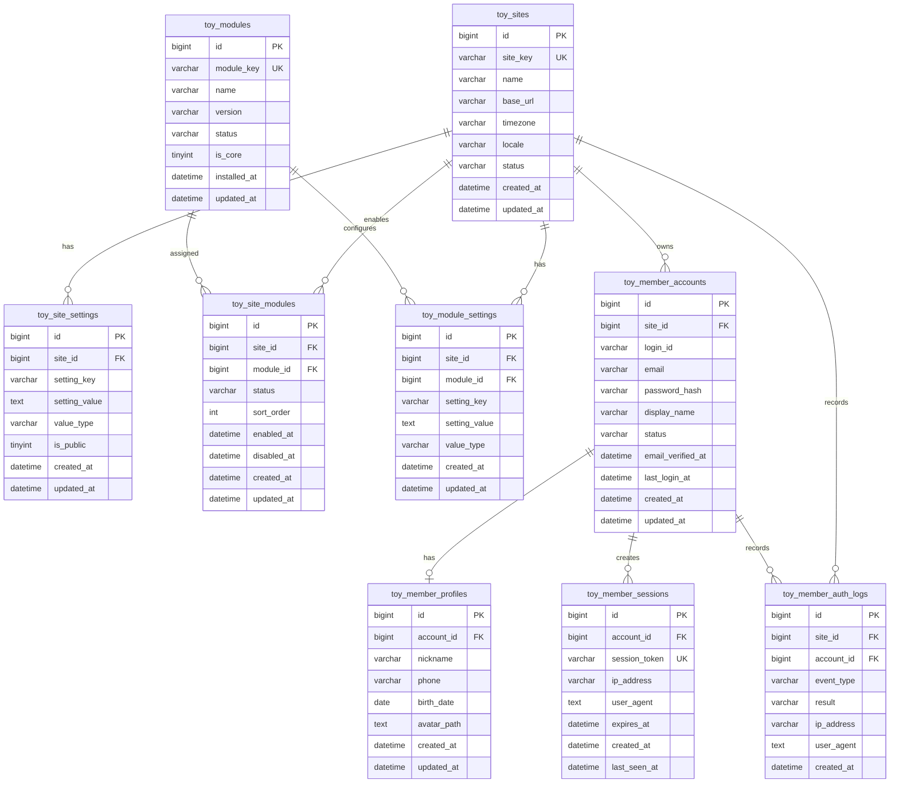

# 기본환경 테이블 ERD

Toycore의 기본환경은 사이트 설정과 모듈 시스템을 중심으로 구성합니다.

회원 인증은 대부분의 사이트에서 기본적으로 사용되지만, 코어에 고정된 기능이 아니라 `member` 모듈로 취급합니다. 따라서 회원 관련 테이블은 기본 배포에 포함될 수 있으나, 구조상으로는 모듈 테이블과 모듈 설정을 통해 활성화되는 기능으로 봅니다.

## 설계 원칙

- 사이트 환경은 코어가 항상 읽을 수 있는 최소 설정으로 유지
- 기능 단위는 모듈로 등록하고 활성화 여부를 관리
- 회원 인증은 기본 제공 모듈이지만 코어와 직접 결합하지 않음
- 저가형 웹호스팅을 고려해 단순한 관계와 일반적인 SQL 타입 사용
- 설정값은 확장성을 위해 key-value 구조를 기본으로 사용

## ERD



## 테이블 설명

### `toy_sites`

사이트의 기본 정보를 저장합니다. 단일 사이트만 운영하더라도 `site_id` 기준을 유지하면 이후 멀티사이트 구조로 확장하기 쉽습니다.

주요 값:

- `site_key`: 사이트를 구분하는 짧은 고유 키
- `name`: 사이트 이름
- `base_url`: 사이트 기본 URL
- `timezone`: 기본 시간대
- `locale`: 기본 언어와 지역
- `status`: `active`, `inactive`, `maintenance`

### `toy_site_settings`

사이트 전체 설정을 key-value 형태로 저장합니다. 예를 들어 사이트 제목, 관리자 이메일, 업로드 제한, 기본 테마 같은 값을 저장할 수 있습니다.

권장 유니크 키:

- `site_id`, `setting_key`

### `toy_modules`

설치 가능한 모듈의 레지스트리입니다. 회원 인증도 이 테이블에 `member` 모듈로 등록합니다.

예시:

| module_key | name | is_core |
| --- | --- | --- |
| `member` | 회원 | `1` |
| `board` | 게시판 | `0` |
| `page` | 페이지 | `0` |

### `toy_site_modules`

사이트별 모듈 활성화 상태를 저장합니다. 모듈은 설치되어 있어도 특정 사이트에서 비활성화될 수 있습니다.

권장 유니크 키:

- `site_id`, `module_id`

### `toy_module_settings`

모듈별 설정을 저장합니다. 같은 설정 키라도 모듈과 사이트에 따라 다른 값을 가질 수 있습니다.

예시:

| module | setting_key | setting_value |
| --- | --- | --- |
| `member` | `allow_signup` | `1` |
| `member` | `login_id_type` | `email` |
| `member` | `session_lifetime` | `7200` |

권장 유니크 키:

- `site_id`, `module_id`, `setting_key`

## 회원 인증 모듈

회원 인증은 `member` 모듈의 책임으로 분리합니다.

### `toy_member_accounts`

로그인 가능한 회원 계정의 핵심 정보를 저장합니다.

권장 유니크 키:

- `site_id`, `login_id`
- `site_id`, `email`

### `toy_member_profiles`

회원의 부가 정보를 저장합니다. 인증에 필요한 핵심 계정 정보와 프로필 정보를 분리해, 필수 인증 로직이 프로필 확장에 영향을 덜 받도록 합니다.

### `toy_member_sessions`

로그인 세션을 저장합니다. PHP 기본 세션만 사용할 수도 있지만, 자동 로그인, 세션 만료 관리, 강제 로그아웃 같은 기능을 고려하면 별도 테이블을 두는 편이 확장에 유리합니다.

### `toy_member_auth_logs`

로그인, 로그아웃, 로그인 실패, 비밀번호 변경 같은 인증 관련 이벤트를 기록합니다. 보안 문제 추적과 관리자 확인 용도로 사용합니다.

## 초기 모듈 상태 예시

기본 설치 시 다음과 같이 시작할 수 있습니다.

```text
toy_modules
- member: installed, core module

toy_site_modules
- default site + member: enabled
```

이 구조에서는 회원 인증이 기본적으로 켜져 있지만, 코드 관점에서는 여전히 `member` 모듈로 분리됩니다.

## 구현 시 고려사항

- 비밀번호는 반드시 `password_hash()` 결과만 저장
- 세션 토큰은 원문 대신 해시 저장을 우선 검토
- 설정값의 `value_type`은 `string`, `int`, `bool`, `json` 정도로 제한
- `created_at`, `updated_at`은 모든 주요 테이블에 일관되게 사용
- 삭제가 많은 데이터는 실제 삭제와 소프트 삭제 중 운영 정책을 먼저 결정
- 저가형 웹호스팅 호환성을 위해 트리거, 저장 프로시저, 복잡한 DB 기능 의존은 최소화
