# 기본환경 테이블 ERD

Toycore의 기본환경은 사이트 설정과 모듈 시스템을 중심으로 구성합니다.

회원 인증은 대부분의 사이트에서 기본적으로 사용되지만, 코어에 고정된 기능이 아니라 `member` 모듈로 취급합니다. 따라서 회원 관련 테이블은 기본 배포에 포함될 수 있으나, 구조상으로는 모듈 테이블과 모듈 설정을 통해 활성화되는 기능으로 봅니다.

이 ERD는 코어 전용 테이블만이 아니라 기본 배포(`core + member + admin + seo + popup_layer`)에서 함께 설치되는 테이블까지 보여줍니다. `member`, `admin`, `seo`, `popup_layer`는 기본 제공 모듈이지만 코어에 내장된 테이블 소유권을 갖지는 않습니다.

아래 ERD는 현재 설치 SQL과 기본 제공 모듈의 설치 SQL을 기준으로 합니다. 과거 MVP 범위보다 넓어진 감사 로그, 개인정보 요청, 회원 프로필, DB 세션, 팝업레이어 테이블도 현재 구현 범위로 포함합니다.

## 설계 원칙

- 사이트 환경은 코어가 항상 읽을 수 있는 최소 설정으로 유지
- 기능 단위는 모듈로 등록하고 활성화 여부를 관리
- 회원 인증은 기본 제공 모듈이지만 코어와 직접 결합하지 않음
- 저가형 웹호스팅을 고려해 단순한 관계와 일반적인 SQL 타입 사용
- 설정값은 확장성을 위해 key-value 구조를 기본으로 사용
- 첫 구현은 단일 사이트 기준으로 시작하고 멀티사이트용 연결 테이블은 보류
- 다국어와 개인정보 처리는 최소 기반만 초기 구조에 포함

## ERD

```mermaid
erDiagram
    toy_sites {
        bigint id PK
        varchar site_key UK
        varchar name
        varchar base_url
        varchar timezone
        varchar default_locale
        varchar status
        datetime created_at
        datetime updated_at
    }

    toy_site_settings {
        bigint id PK
        varchar setting_key
        text setting_value
        varchar value_type
        tinyint is_public
        datetime created_at
        datetime updated_at
    }

    toy_modules {
        bigint id PK
        varchar module_key UK
        varchar name
        varchar version
        varchar status
        tinyint is_bundled
        datetime installed_at
        datetime updated_at
    }

    toy_module_settings {
        bigint id PK
        bigint module_id FK
        varchar setting_key
        text setting_value
        varchar value_type
        datetime created_at
        datetime updated_at
    }

    toy_schema_versions {
        bigint id PK
        varchar scope
        varchar module_key
        varchar version
        datetime applied_at
    }

    toy_audit_logs {
        bigint id PK
        bigint actor_account_id "nullable, logical reference"
        varchar actor_type
        varchar event_type
        varchar target_type
        varchar target_id
        varchar result
        varchar ip_address
        text user_agent
        text message
        text metadata_json
        datetime created_at
    }

    toy_member_accounts {
        bigint id PK
        varchar account_identifier_hash
        varchar login_id_hash
        varchar email
        varchar email_hash
        varchar password_hash
        varchar display_name
        varchar locale
        varchar status
        datetime email_verified_at
        datetime last_login_at
        datetime created_at
        datetime updated_at
    }

    toy_member_profiles {
        bigint id PK
        bigint account_id FK
        varchar nickname
        varchar phone
        date birth_date
        varchar avatar_path
        text profile_text
        datetime created_at
        datetime updated_at
    }

    toy_member_sessions {
        bigint id PK
        bigint account_id FK
        varchar session_token_hash UK
        varchar remember_token_hash "nullable"
        varchar ip_address
        text user_agent
        datetime expires_at
        datetime revoked_at
        datetime created_at
        datetime last_seen_at
    }

    toy_member_auth_logs {
        bigint id PK
        bigint account_id FK "nullable"
        varchar event_type
        varchar result
        varchar ip_address
        text user_agent
        datetime created_at
    }

    toy_member_consents {
        bigint id PK
        bigint account_id FK
        varchar consent_key
        varchar consent_version
        tinyint consented
        varchar ip_address
        text user_agent
        datetime created_at
    }

    toy_member_password_resets {
        bigint id PK
        bigint account_id FK
        varchar reset_token_hash UK
        datetime expires_at
        datetime used_at
        datetime created_at
    }

    toy_member_email_verifications {
        bigint id PK
        bigint account_id FK
        varchar email
        varchar verification_token_hash UK
        datetime expires_at
        datetime verified_at
        datetime created_at
    }

    toy_admin_account_roles {
        bigint id PK
        bigint account_id FK
        varchar role_key
        datetime created_at
    }

    toy_privacy_requests {
        bigint id PK
        bigint account_id FK "nullable"
        varchar request_type
        varchar status
        varchar requester_email_hash
        varchar requester_snapshot
        text request_message
        text admin_note
        bigint handled_by_account_id "nullable"
        datetime handled_at
        datetime created_at
        datetime updated_at
    }

    toy_popup_layers {
        bigint id PK
        varchar title
        text body_text
        varchar status
        datetime starts_at
        datetime ends_at
        int dismiss_cookie_days
        datetime created_at
        datetime updated_at
    }

    toy_popup_layer_targets {
        bigint id PK
        bigint popup_layer_id FK
        varchar module_key
        varchar point_key
        varchar slot_key
        varchar subject_id
        varchar match_type
        datetime created_at
    }

    toy_sites ||--o{ toy_site_settings : has
    toy_modules ||--o{ toy_module_settings : configures

    toy_member_accounts ||--o| toy_member_profiles : has
    toy_member_accounts ||--o{ toy_member_sessions : creates
    toy_member_accounts |o--o{ toy_member_auth_logs : optionally_records
    toy_member_accounts ||--o{ toy_member_consents : grants
    toy_member_accounts ||--o{ toy_member_password_resets : requests
    toy_member_accounts ||--o{ toy_member_email_verifications : verifies
    toy_member_accounts ||--o{ toy_admin_account_roles : receives
    toy_member_accounts |o--o{ toy_privacy_requests : optionally_submits
    toy_popup_layers ||--o{ toy_popup_layer_targets : targets
```



## 테이블 설명

### `toy_sites`

현재 설치의 사이트 기본 정보를 저장합니다. 첫 구현은 단일 사이트 기준이므로 이 테이블은 멀티사이트 목록이 아니라 기본 사이트 설정 레코드에 가깝습니다.

주요 값:

- `site_key`: 사이트를 구분하는 짧은 고유 키
- `name`: 사이트 이름
- `base_url`: 사이트 기본 URL
- `timezone`: 기본 시간대
- `default_locale`: 기본 언어와 지역
- `status`: `active`, `inactive`, `maintenance`

### `toy_site_settings`

사이트 전체 설정을 key-value 형태로 저장합니다. 예를 들어 사이트 제목, 관리자 이메일, 업로드 제한, 기본 테마 같은 값을 저장할 수 있습니다.

권장 유니크 키:

- `setting_key`

### `toy_modules`

설치 가능한 모듈의 레지스트리입니다. 회원 인증도 이 테이블에 `member` 모듈로 등록합니다.

예시:

| module_key | name | is_bundled |
| --- | --- | --- |
| `member` | 회원 | `1` |
| `admin` | 관리자 | `1` |
| `seo` | SEO | `1` |
| `popup_layer` | 팝업레이어 | `1` |
| `board` | 게시판 | `0` |
| `page` | 페이지 | `0` |

모듈 활성화 상태는 초기 구현에서 `toy_modules.status`로 관리합니다. 사이트별 모듈 활성화가 필요해지는 시점에 `toy_site_modules` 같은 연결 테이블을 추가합니다.

### `toy_module_settings`

모듈별 설정을 저장합니다.

예시:

| module | setting_key | setting_value |
| --- | --- | --- |
| `member` | `allow_registration` | `1` |
| `member` | `email_verification_enabled` | `1` |
| `member` | `login_identifier` | `email` |
| `member` | `login_throttle_window_seconds` | `900` |

권장 유니크 키:

- `module_id`, `setting_key`

### `toy_schema_versions`

코어와 모듈의 스키마 적용 버전을 기록합니다. 프레임워크형 migration 클래스 대신 SQL 파일과 이 테이블을 사용해 설치/업데이트 상태를 추적합니다.

권장 유니크 키:

- `scope`, `module_key`, `version`

주요 값:

- `scope`: `core`, `module`
- `module_key`: 코어 업데이트는 빈 문자열, 모듈 업데이트는 모듈 키 사용
- `version`: 정렬 가능한 버전 문자열

### `toy_audit_logs`

관리자 작업, 설정 변경, 모듈 활성화, 개인정보 요청 처리, 보관 정리 같은 운영상 중요한 이벤트를 기록합니다.

`actor_account_id`는 `member` 모듈 계정을 가리킬 수 있지만, 코어 테이블이 `toy_member_accounts`에 직접 DB FK로 묶이지 않도록 nullable 논리 참조로 둡니다. 계정 존재 여부와 표시 이름 해석은 `member`/`admin` 모듈 쪽에서 처리합니다.

기록 금지:

- 비밀번호
- 세션 ID
- CSRF 토큰
- 비밀번호 재설정 토큰
- DB 접속 비밀번호
- 개인정보 원문 전체

## 회원 인증 모듈

회원 인증은 `member` 모듈의 책임으로 분리합니다.

### `toy_member_accounts`

로그인 가능한 회원 계정의 핵심 정보를 저장합니다.

권장 유니크 키:

- `account_identifier_hash`
- `email_hash`

회원 기본 테이블에는 `site_id`를 넣지 않습니다.

Toycore의 첫 구현은 단일 사이트 운영을 기준으로 합니다. `toy_sites`는 사이트 이름, base URL, timezone, default locale, 운영 상태 같은 설정을 담는 코어 테이블로 남길 수 있지만, 회원 계정이 별도 `site_id`를 들고 다닐 필요는 없습니다. 멀티사이트를 실제 기능으로 제공한다면 그때 회원/관리자/모듈 데이터에 `site_id`를 추가하는 스키마 업데이트를 설계합니다.

로그인 식별자는 원문보다 정규화된 값의 hash를 기준으로 조회합니다.

```text
account_identifier_hash: 현재 로그인 방식의 대표 식별자 hash
login_id_hash: 별도 아이디 로그인 사용 시 아이디 hash
email_hash: 이메일 정규화 hash
```

관리자는 로그인 방식을 선택할 수 있습니다.

```text
member.login_identifier = email
member.login_identifier = login_id
```

이메일 로그인 모드에서는 `account_identifier_hash`가 `email_hash`와 같은 값이 될 수 있습니다. 별도 아이디 로그인 모드에서는 `account_identifier_hash`가 `login_id_hash`를 사용합니다.

hash는 로그인 조회와 중복 검사를 위해 deterministic 해야 하므로, 설정 파일의 비밀값을 사용하는 HMAC 방식을 우선합니다.

```text
hash_hmac('sha256', normalized_identifier, app_key)
```

`email` 원문은 메일 발송과 사용자 안내를 위해 저장할 수 있지만, 조회와 중복 검사는 `email_hash`로 수행합니다. 별도 로그인 아이디 원문은 기본 저장 대상이 아니며, 화면 표시는 `display_name` 또는 각 모듈의 표시명 정책을 사용합니다.

`locale`은 회원이 선호하는 화면 언어를 저장합니다. 값이 없으면 사이트 기본 locale을 사용합니다.

### `toy_member_profiles`

회원의 부가 정보를 저장합니다. 인증에 필요한 핵심 계정 정보와 프로필 정보를 분리해, 필수 인증 로직이 프로필 확장에 영향을 덜 받도록 합니다.

현재 구현은 계정 화면의 선택 프로필 수정 기능과 함께 이 테이블을 도입합니다.

### `toy_member_sessions`

로그인 세션을 저장합니다. PHP 기본 세션만 사용할 수도 있지만, 자동 로그인, 세션 만료 관리, 강제 로그아웃 같은 기능을 고려하면 별도 테이블을 두는 편이 확장에 유리합니다.

`session_token_hash`에는 토큰 원문이 아니라 해시만 저장합니다. 세션, 자동 로그인, 비밀번호 재설정, 이메일 인증 같은 토큰은 원문 저장을 기본 금지합니다.

현재 구현은 PHP 기본 세션을 유지하면서 DB 세션 테이블에 로그인 세션을 기록합니다. 관리자 회원 화면에서 활성 세션 수를 확인하고 세션을 강제로 폐기할 수 있습니다.

### `toy_member_auth_logs`

로그인, 로그아웃, 로그인 실패, 비밀번호 변경 같은 인증 관련 이벤트를 기록합니다. 보안 문제 추적과 관리자 확인 용도로 사용합니다.

`account_id`는 로그인 성공이나 계정이 확인된 이벤트에서는 연결하지만, 존재하지 않는 계정으로 로그인 실패가 발생할 수 있으므로 nullable로 둡니다. 실패 시도 식별이 필요하면 계정 존재 여부나 원문 login ID를 노출하지 않도록 제한된 hash 또는 요약값만 별도 정책으로 저장합니다.

### `toy_member_consents`

회원의 약관, 개인정보 처리방침, 마케팅 수신 같은 동의 상태를 기록합니다. 동의 문서의 버전과 동의/철회 시점을 저장해 나중에 어떤 내용에 동의했는지 확인할 수 있게 합니다.

권장 인덱스:

- `account_id`, `consent_key`
- `account_id`, `consent_key`, `consent_version`

현재 구현은 동의/미동의 여부를 `consented`에 저장하고, 동의 시점을 `created_at`으로 기록합니다.

### `toy_member_password_resets`

비밀번호 재설정 요청 token의 hash, 만료 시각, 사용 시각을 저장합니다. token 원문은 저장하지 않습니다.

권장 인덱스:

- `reset_token_hash`
- `account_id`
- `expires_at`

### `toy_member_email_verifications`

이메일 인증 token의 hash, 대상 이메일, 만료 시각, 인증 완료 시각을 저장합니다. token 원문은 저장하지 않습니다.

권장 인덱스:

- `verification_token_hash`
- `account_id`
- `expires_at`

## 관리자 모듈

### `toy_admin_account_roles`

`member` 계정에 관리자 role key를 연결합니다. 초기 구현은 별도 permission 테이블 없이 `owner`, `admin`, `manager` 같은 단순 role key로 시작합니다.

권장 유니크 키:

- `account_id`, `role_key`

### `toy_privacy_requests`

개인정보 열람, 정정, 삭제, 처리 제한, 이동권, 처리 반대, 동의 철회 같은 요청을 기록합니다.

기본 배포에서는 코어 설치 SQL이 테이블을 만들고, `member` 모듈이 요청 접수와 내보내기를, `admin` 모듈이 처리 화면을 담당합니다. 규모가 커져 `privacy` 모듈로 분리하는 경우에도 동일한 데이터 보존 원칙을 유지합니다.

`account_id`는 계정이 남아 있는 동안 연결할 수 있지만, 삭제/익명화 이후에도 요청 이력이 보존될 수 있도록 nullable로 설계합니다. 요청 당시 식별에 필요한 최소 정보는 `requester_email_hash`와 `requester_snapshot`에 저장합니다.

권장 값:

- `request_type`: `access`, `rectification`, `erasure`, `restriction`, `portability`, `objection`, `withdrawal`
- `status`: `requested`, `reviewing`, `completed`, `rejected`, `cancelled`

초기 구현에서는 자동 처리보다 관리자 검토와 처리 이력 보존을 우선합니다.

## 팝업레이어 모듈

### `toy_popup_layers`

팝업레이어 본문과 노출 상태, 기간, 닫기 유지일을 저장합니다.

권장 인덱스:

- `status`, `starts_at`, `ends_at`
- `updated_at`

### `toy_popup_layer_targets`

팝업레이어가 노출될 extension point 조건을 저장합니다.

주요 값:

- `module_key`: 대상 모듈
- `point_key`: 대상 extension point
- `slot_key`: 팝업레이어는 내부 기본값 `overlay`를 사용
- `subject_id`: 특정 상품, 게시판, 글 같은 세부 대상 ID
- `match_type`: `all`, `exact`

권장 인덱스:

- `popup_layer_id`
- `module_key`, `point_key`, `slot_key`, `match_type`, `subject_id`, `popup_layer_id`

## 초기 모듈 상태 예시

기본 설치 시 다음과 같이 시작할 수 있습니다.

```text
toy_modules
- member: enabled, default bundled module
- admin: enabled, default bundled module
- seo: enabled, default bundled module
- popup_layer: enabled, default bundled module
```

이 구조에서는 회원 인증, 관리자 화면, SEO 운영 기반, 팝업레이어가 기본적으로 켜져 있지만, 코드 관점에서는 여전히 각 모듈로 분리됩니다.

## 구현 시 고려사항

- 비밀번호는 반드시 `password_hash()` 결과만 저장
- 세션, 자동 로그인, 인증 관련 토큰은 원문 대신 해시만 저장
- 설정값의 `value_type`은 `string`, `int`, `bool`, `json` 정도로 제한
- locale은 사이트 기본값, 회원 설정값, 요청값의 우선순위를 정해 처리
- 동의 기록은 문서 버전과 시점을 함께 저장
- 개인정보 삭제 요청은 물리 삭제, 비활성화, 익명화 정책을 구분
- 개인정보 요청 이력은 계정 삭제/익명화 이후에도 보존 가능해야 함
- `created_at`, `updated_at`은 모든 주요 테이블에 일관되게 사용
- 삭제가 많은 데이터는 실제 삭제와 소프트 삭제 중 운영 정책을 먼저 결정
- 저가형 웹호스팅 호환성을 위해 트리거, 저장 프로시저, 복잡한 DB 기능 의존은 최소화
